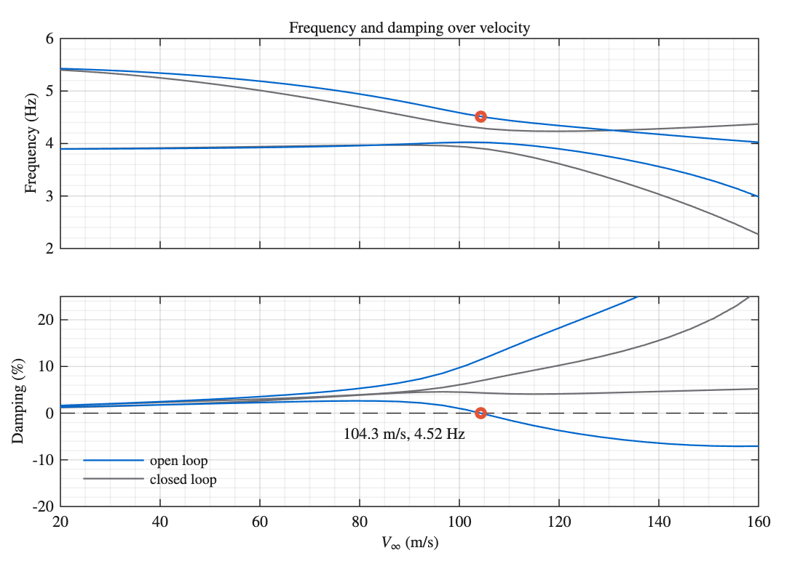
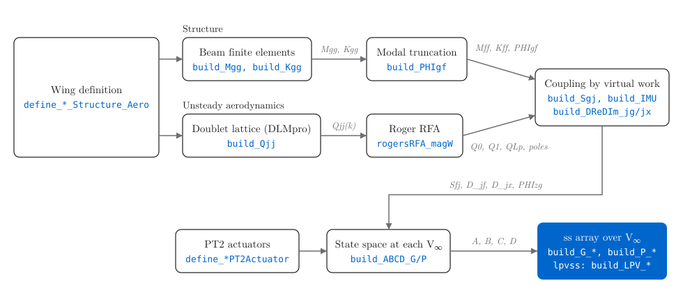

<div align="center">


<p><em>MATLAB wing models for aeroelastic control research.</em></p>


</div>

FlutterWing is your starting point into aeroelastic control. A beam finite element method coupled with doublet-lattice unsteady aerodynamics. Rogers rational function approximation for frequency- to time-domain conversion and PT2 actuator dynamics in a self-contained MATLAB model.

[Understand the model](docs/TUTORIAL.md) · [Reproduce a paper](#papers)

<div align="center">

<p><em>Time-simulation of the Goland wing under disturbance. The AFS controller damps flutter as velocity rises.</em></p>
</div>

## Quick start

You need MATLAB with Control System Toolbox. Clone or download this repository and set MATLAB's Current Folder to its root. Run the guided example:

```matlab
run('startup.m'); % to set the matlab path
QUICKSTART
```

The example builds the RectWing. A rectangular wing modelled loosely after the bending-torsion flutter example of the Wright Cooper textbook on aeroelasticity. The [live-script version](QUICKSTART_live.m) opens in the Live Editor on R2025a or newer.

For just the model and V-g plot, use these calls after `startup.m`:

```matlab
V = linspace(20,160,32);                 % range of freestream velocities
G = build_G_RectWing(V, 1:8, 1:8);       % all 8 sensors and surfaces
EV = getEigenvalueModeshape(G, 5);
load('RectWing_Cont_imu18_ail18.mat');
EV_cl = getEigenvalueModeshape(feedback(G, -RectWing_Cont), 5); % u = K*y
Vg_plot({V,V}, {EV,EV_cl}, {'open loop','closed loop'}, 'Band',[2 10]);
```

The flutter onset is **104.3 m/s at 4.52 Hz**. With the supplied controller, the model is stable at all sampled velocities through 160 m/s.
<div align="center">

<p><em>Frequency (top) and damping (bottom) of the bending and torsion modes.</em></p>
</div>

## What you get

- **Two wings.** The Goland benchmark wing has one flap and one accelerometer; the model flutters at 164.8&nbsp;m/s, 11.3&nbsp;Hz. It is the simpler case used in the tutorial. The RectWing research wing has four trailing-edge flaps, four leading-edge slats and eight accelerometers at the hinge-line centres; it flutters at 104.3&nbsp;m/s, 4.5&nbsp;Hz.
- **Control-ready models.** `ss` arrays over velocity with named channels (`flap1_d` to `slat4_d` in, `u_z1_ddot` to `u_z8_ddot` out), 40 plant states plus 2 per actuator. Generalized plants (`build_P_*`) add disturbance, noise and performance channels for `systune`; `lpvss` models (`build_LPV_*`) cover velocity ramps.
- **Flutter analysis tools.** p and p-k methods, V-g plots with interpolated crossings, pole maps, RFA fit diagnostics, wing animations; `help util` lists them.
- **Shipped controllers with their synthesis scripts.** The RectWing static gain of the animation (`R01_Synthesize_RectWing_Controller.m`) and the Goland controller of the tutorial (`R00_Synthesize_Goland_Controller.m`).


## How it works

<div align="center">

</div>

A wing definition is geometry, beam properties, and panel grid. The structural beam finite elements model is build and modally truncated to the first `n_f` structural (vibration) eigenmodes. Higher frequency modes are currently still entirely discarded, the mode acceleration method is in development. The doublet lattice aerodynamics compute unsteady air loads on `n_p` panels. The resulting complex valued aerodynamic influence coefficient matrices are fitted using Roger's rational function approximation, which eventually translates the frequency domain AIC data into the time domain. Virtual work on the beam shape functions couples the fitted aerodynamic model to the FEM. Second-order PT2 actuator models are assumed. The result is one state-space model per velocity. Since the aeroelastic dynamics are much faster than the changes in airspeed (free-stream velocity) a linear parameter-varying (LPV) model description is suitable.

## Learn the physics

The tutorial uses the Goland wing, the textbook case for bending-torsion flutter. [docs/TUTORIAL.md](docs/TUTORIAL.md) reads all figures and equations. [TUTORIAL.m](live_plain_m/TUTORIAL.m) runs alongside in MATLAB. The tutorial builds the wing from the beam element to a virtual flight through the flutter boundary. The coordinate frames, sign rules and numberings of the code may be found in [docs/CONVENTIONS.md](docs/CONVENTIONS.md).


## Papers

| Paper | Venue | Code |
|---|---|---|
| Open-Source Benchmark Model for Active Flutter Suppression | AIAA SciTech DOI: [10.2514/6.2026-1555](https://doi.org/10.2514/6.2026-1555) | [folder](research-paper-code/SciTech2026-Open-Source_Benchmark_Model_for_Active_Flutter_Suppression) |
| Modal Blending for Active Flutter Suppression | AIAA SciTech DOI: [10.2514/6.2026-1556](https://doi.org/10.2514/6.2026-1556) | [folder](research-paper-code/SciTech2026-Modal_Blending_for_Active_Flutter_Suppression) |
| Structural Blending for Active Flutter Suppression | IFASD 2026| [folder](research-paper-code/IFASD2026-Structural_Blending_for_Active_Flutter_Suppression) |
| Subspace Geometry and Performance Tradeoffs of Modal Blending for AFS | *Aerospace Systems* to appear | [folder](research-paper-code/AS2026-Subspace-Geometry-and-Performance-Tradeoffs-of-Modal-Blending-for-AFS) |


## Citing

If you use FlutterWing in your research, please cite the benchmark paper:

```bibtex
@inproceedings{Eichelsdoerfer2026Benchmark,
  author    = {Eichelsd{\"o}rfer, Jonas},
  title     = {Open-Source Benchmark Model for Active Flutter Suppression},
  booktitle = {AIAA SCITECH 2026 Forum},
  year      = {2026},
  note      = {AIAA 2026-1555},
  doi       = {10.2514/6.2026-1555}
}
```

<details>
<summary>BibTeX for the modal blending paper</summary>

```bibtex
@inproceedings{Eichelsdoerfer2026ModalBlending,
  author    = {Eichelsd{\"o}rfer, Jonas},
  title     = {Modal Blending for Active Flutter Suppression},
  booktitle = {AIAA SCITECH 2026 Forum},
  year      = {2026},
  note      = {AIAA 2026-1556},
  doi       = {10.2514/6.2026-1556}
}
```

</details>

## License and third-party code

FlutterWing is released under the [GPL-3.0 license](LICENSE); The doublet-lattice solver is DLMpro by Nils Böhnisch and Marc Bangel ([github.com/BoeNils/DLMpro](https://github.com/BoeNils/DLMpro), GPL-3.0 license)
