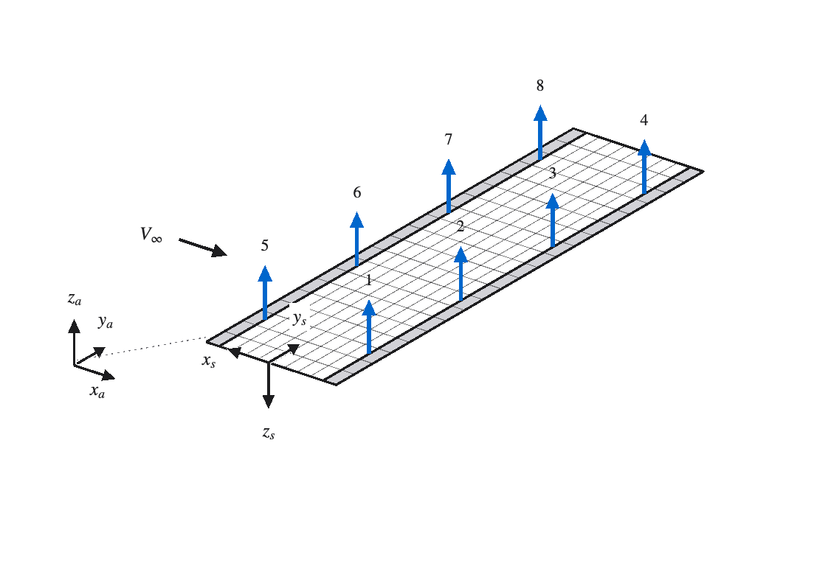

# Conventions

Please note the following conventions used throughout the repository.

## 1. The two frames
The geometry is expressed equally  in `Pa` aerodynamic coordinates used by the aerodynamic model (DLM) `build_Qjj`, and `build_DReDIm_jx` and `Ps` structural coordinate system used by the structural model (FEM) `build_E_y`, `build_Sgj`, `build_DReDIm_jg`, `build_IMU`, and `beamPHI`. 

<p align="center"></p>
<p align="center"><em>The Rectangular Wing. Structural coordinates at the flexural axis root; Aerodynamic coordinates at the leading edge root.Flaps 1 to 4 along the trailing edge; slats 5 to 8 along the leading edge. One accelerometer at every hinge midpoint.</em></p>

The rotation from `Pa` to `Ps` coordinates is `R_sa = [x_s, y_s, z_s]'` with the three structural basis vectors expressed in `Pa`; for the unswept, flat, untapered wing `R_sa = diag(-1, +1, -1)` followed by a shift of the origin: `x_s = xf*c - x_a`, `y_s = y_a`, `z_s = -z_a`.

`build_PaPs` accepts sweep, dihedral and taper, the coupling however assumes an unswept beam. General coupling is coming soon.

## 2. Signs

Note the following sign conventions:
- `u_z` bending deflection is positive down
- `psi_y` twist about `y_s` is positive leading edge up, with `x_s` positive toward the leading edge
- `flapN_d` flap deflection is positive trailing edge down
- `slatN_d` slat deflection is positive leading edge down
- `w_j` dowmwash `w_j = u_z_j / V_inf` at the three-quarter-chord control point is positive when the surface moves down into the flow
- `Delta c_p = Delta p / q_bar` differential pressure coefficient is positive lift up 
- `u_z_ddot` accelerometer output is positive along `z_s`, i.e. down.
- `k_red` reduced frequency is defined as `omega*c_ref/(2*V_inf)` with `c_ref` the full chord

## 3. Panel corners

```
                    root ---------------------> tip   (+y_a, +y_s)
   upstream           1 ------------------- 4
   (leading-edge      |                     |         1 = leading edge,  inboard
    side)             |          x  JP      |         2 = trailing edge, inboard
        |             |       (3/4 chord)   |         3 = trailing edge, outboard
        v             |                     |         4 = leading edge,  outboard
      +x_a            2 ------------------- 3
   downstream
```

`build_PaPs.m` is identical in `Pa` and `Ps`. `P2 - P1` is the chord vector (downstream), `P4 - P1` the span vector, and the normal `N = cross(P2 - P1, P4 - P1)` points up in both frames (`+z_a`, `-z_s`). The load point of a panel is the midpoint of its quarter-chord line, `0.5*((0.75*P1 + 0.25*P2) + (0.75*P4 + 0.25*P3))`; the control point `JP` the midpoint of its three-quarter-chord line.

## 4. Panel numbering

Panels are numbered row by row against the flow:
```
   Goland:   41 42 43 ... 50   <- leading edge
             31 32 33 ... 40
             21 22 23 ... 30
             11 12 13 ... 20
              1  2  3 ... 10   <- trailing edge
             root -------> tip
```

## 5. Control surfaces and sensors
Control surfaces are numbered as:

```
     slats (leading edge)
   -5-6-7-8-
  |         |
   -1-2-3-4-
     flaps (trailing edge)      root on the left, tip on the right
```

Sensor k sits at the midpoint of the hinge line of surface k, so `imuIDX` and `ailIDX` share one numbering. A trailing-edge surface hinges on the leading edge of its panel block, a leading-edge surface on the trailing edge of its block. Sensors anywhere is supported by `build_IMU(x_pos, y_pos, E, ele)` with positions in `Ps`.

## 6. Subscripts

Matrix names carry NASTRAN-style set subscripts: `g` physical FEM degrees of freedom (three per node, `[u_z; du_z/dy; psi_y]`, 3·(elements + 1) in total), `f` generalized (modal) coordinates, `j` aerodynamic panels, `x` control-surface inputs, `z` sensor outputs.

| Matrix | Maps | Goland | RectWing |
|---|---|---|---|
| `Kgg`, `Mgg` | physical stiffness and mass | 33 × 33 | 51 × 51 |
| `PHIgf` | modeshapes `q_g = PHIgf*q_f` | 33 × 5 | 51 × 5 |
| `Mff`, `Kff`, `Dff` | generalized mass, stiffness, damping | 5 × 5 | 5 × 5 |
| `Sgj`, `Sfj` | panel pressure coefficients to nodal or modal forces  | 33/5 × 50 | 51/5 × 200 |
| `DRe_jg`, `DIm_jg`, `DRe_jf`, `DIm_jf` | motion to downwash | 50 × 33/5 | 200 × 51/5 |
| `DRe_jx`, `DIm_jx` | surface deflection (and rate) to downwash | 50 × 1 | 200 × 8 |
| `PHIzg` | nodal acceleration to sensor acceleration | 1 × 33 | 8 × 51 |
| `Qjj`, `Q0jj`, `Q1jj`, `QLpjj` | downwash to pressure coefficient (Roger fit) | 50 × 50 × 6 | 200 × 200 × 6 |

## 7. Index arguments and constants

| Name | Meaning |
|---|---|
| `imuIDX` | selected sensors |
| `ailIDX` | selected surfaces | 
| `modesIDX` | modes with disturbance inputs and performance outputs in `P` |
| `num_modes` | structural modes kept |
| `num_poles` | Roger lag poles |


## 8. Scaling

State, Input and Output Scaling:

| Block | Scale |
|---|---|
| states `q_f` | 1 |
| states `q_f_dot` | `OMEGA` |
| states `aero_lag` | `q_bar_ref*c_ref^2`, `q_bar_ref = 0.5*rho*V_inf_ref^2` |
| actuator states | `[1; w0]`, `w0 = 2*pi*32` |
| output `u_z_ddot` of `G` and `P`, input `noise_u_z_ddot` | `Kff(1,1)/Mff(1,1)` (= `OMEGA(1)^2`) |
| outputs `q_f` of `P` | `sqrt(Kff(1,1))./sqrt(diag(Kff))` |
| outputs `q_f_dot` and inputs `dist_q_f_ddot` of `P` | `sqrt(Kff(1,1))./sqrt(diag(Mff))` |
| demands `flapN_d`, `slatN_d` | 1 | 

The values depend on the mode-shape normalisation of `build_PHIgf` (largest entry of each column is one), which makes `Mff` diagonal but not the identity. Chapter 12 of the tutorial gives the energy argument behind the `P` scales.
