# The Goland wing from beam element to virtual flight

Build the Goland wing from beam elements to a controlled aeroelastic model, with equations, experiments and pre-rendered results.

This page can be read without MATLAB. To run [`TUTORIAL.m`](../TUTORIAL.m), use MATLAB R2023a or newer with Control System Toolbox. Set the Current Folder to the repository root and run `startup.m`. [`live/TUTORIAL_live.m`](../live/TUTORIAL_live.m) opens in the Live Editor on R2025a or newer. See [CONVENTIONS.md](CONVENTIONS.md) for the coordinate frames, signs, numbering and scaling.

## Contents

- [0. What is flutter and why this repository](#0-what-is-flutter-and-why-this-repository)
- [1. The Goland wing in numbers](#1-the-goland-wing-in-numbers)
- [2. The structure: a bending-torsion beam FEM](#2-the-structure-a-bending-torsion-beam-fem)
- [3. The aerodynamics: doublet lattice](#3-the-aerodynamics-doublet-lattice)
- [4. Coupling the two grids and projecting onto modes](#4-coupling-the-two-grids-and-projecting-onto-modes)
- [5. From frequency to time: Roger's RFA](#5-from-frequency-to-time-rogers-rfa)
- [6. Flutter analysis I: the p-method, the flutter mode](#6-flutter-analysis-i-the-p-method-the-flutter-mode)
- [7. Flutter analysis II: the p-k method as reference](#7-flutter-analysis-ii-the-p-k-method-as-reference)
- [8. Control surface, accelerometer, actuator](#8-control-surface-accelerometer-actuator)
- [9. The plant G and why AFS is hard](#9-the-plant-g-and-why-afs-is-hard)
- [10. Closing the loop](#10-closing-the-loop)
- [11. Virtual flight: AFS in the time domain](#11-virtual-flight-afs-in-the-time-domain)
- [12. How the shipped controller was designed (optional)](#12-how-the-shipped-controller-was-designed-optional)
- [Where to go next](#where-to-go-next)

Plan about an hour with the derivation blocks collapsed. Each chapter links to its source functions and matching script section.

## 0. What is flutter and why this repository

The textbook definition of flutter: Flutter denotes a self-excited aeroelastic instability arising from the interaction of unsteady aerodynamics with structural modes, often involving coupling between bending and torsional dynamics.

<p align="center">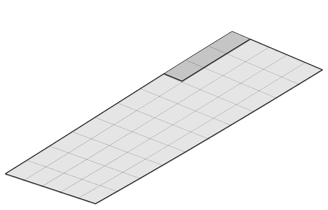</p>
<p align="center"><em>The Goland wing at 180 m/s, about 15 m/s above flutter onset. Bending and twist grow together, out of phase.</em></p>


Flutter occurs when two or more structural modes couple through the aerodynamic forces induced by their oscillation. When the net work produced by the airflow over one structural oscillatory cycle becomes positive, i.e. the airflow pumps energy into the structure, the oscillation grows unbounded. On the Goland wing, the benchmark case treated in this tutorial, this happens at about 165 m/s. Bending and twist couple: twist changes the lift, and lift drives bending.

As modern aircraft design trends increasingly favor lightweight and flexible structures, the susceptibility to the flutter phenomenon emerges as a fundamental constraint. Conventional approaches mitigate this risk through conservative structural design. However,active control techniques offer the potential to extend operational boundaries by artificially increasing modal damping.

### The V-g plot

Everything this tutorial computes ends up in one type of plot. The linear model of the wing at one airspeed $`V_\infty`$ has eigenvalues $`\lambda = \sigma + \mathrm{i}\omega`$, one pair per retained structural mode. Each pair is drawn as a frequency and a damping,

$$
f = \frac{|\lambda|}{2\pi}, \qquad g = -100\,\frac{\mathrm{Re}\,\lambda}{|\lambda|} ,
$$

which is what `Vg_plot` draws: $`f`$ in Hz on top, $`g`$ in percent below (the damping ratio $`\zeta`$ in percent, positive when the motion decays). Displayed over the relevant range of airspeeds.

<p align="center">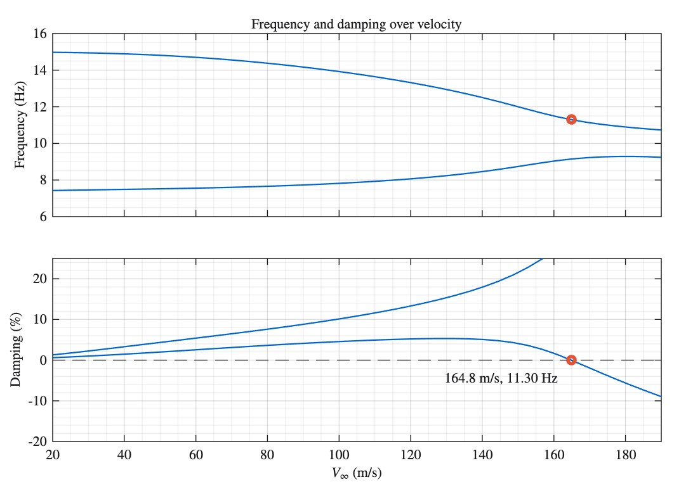</p>
<p align="center"><em>The V-g plot of the Goland wing, open loop. Two modes, bending and torsion, tracked from 20 to 190 m/s. Their frequencies approach as the airspeed rises. The damping crosses zero at 164.8 m/s: flutter.</em></p>

Here only the bending and torsion modes are displayed for clarity. Read the plot from left to right. At low airspeed the two modes sit at their wind-off frequencies, 7.67 Hz for bending and 15.27 Hz for torsion. As $`V_\infty`$ grows, the aerodynamic forces pull the torsion frequency down and push the bending frequency up. Below the flutter speed the air takes energy out of the motion, at the flutter speed the system is marginally stable.

### Why this repository exists

When I started my PhD in active control of aeroelastic systems some years ago, I struggled to find a plant model to try my controller synthesis ideas on. The industrial models I encountered had hundreds of poles and layers of SIMULINK blocks, backed by NASTRAN models tuned against CFD and test data. I could work with their linearized $`A`$, $`B`$, $`C`$, $`D`$ matrices, but following each matrix back to the physics was difficult.

Two-dimensional airfoil models were easier to inspect, but the results typically do not generalize to the industrial setting. Hence I (somewhat foolishly) decided to build my own model: simple enough to follow along and understand the physics, yet with the same modeling stages used in industrial preliminary loads analysis.

The result is this repository. The code is self-contained MATLAB, with short functions that can be inspected and modified individually.

### What the model assumes

The results depend on the following assumptions.

> - **A slender wing as a beam.** The structure is a one-dimensional cantilever beam along the flexural axis with bending and torsion. Chordwise deformation does not exist.
> - **Flat-plate potential flow.** The unsteady air loads come from the planar doublet-lattice method (DLM), a frequency-domain solution of the linearised potential-flow equations: thin flat lifting surface, small motions, inviscid and irrotational flow. The Mach number is fixed per build and is zero (incompressible flow) for both wings of this repository.
> - **A few modes.** The structure is reduced to its first five vibration modes before any aerodynamics is attached; flutter of a clean wing lives in the lowest ones.
> - **Coupling by virtual work.** Panel forces reach the beam, and beam motion reaches the panels, through the beam's own shape functions along a rigid bar perpendicular to the beam. No surface spline, no interpolation layer.
> - **Linear and time-invariant per airspeed.** The result is one state-space model per freestream velocity, stored as an `ss` array, or the same family as a velocity-scheduled `lpvss` for simulation.
> - **Second-order actuators.** Each control surface is driven by a second-order servo model without deflection or rate limits.


**Source:** the whole pipeline is `define/define_Goland_Structure_Aero.m` feeding `build/build_G_Goland.m`. **Run it:** section (0) of `TUTORIAL.m` is explanatory; run sections (1) to (12) in order.

## 1. The Goland wing in numbers

<p align="center">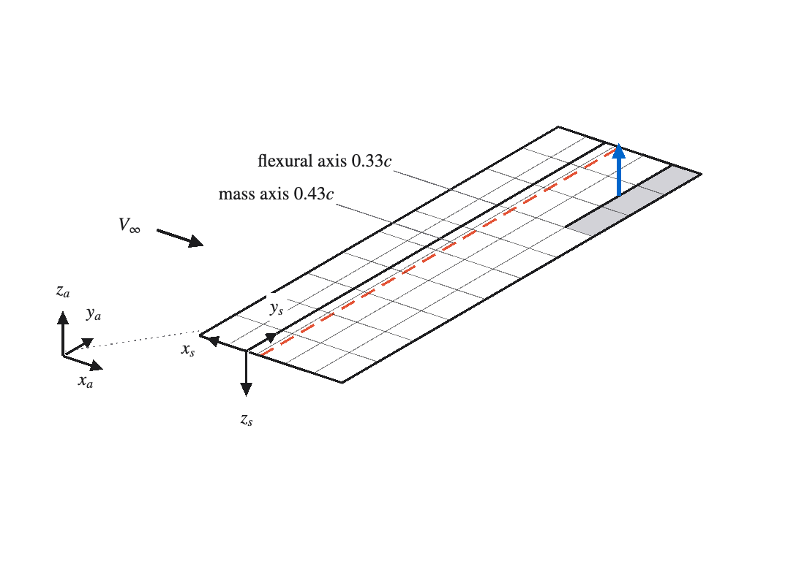</p>
<p align="center"><em>The Goland wing: 5 by 10 aerodynamic panels, an outboard flap (grey), and an accelerometer at the flap hinge (blue arrow). The mass axis lies 0.1 chord behind the flexural axis; chapter 6 tests the effect of moving it. The root triads show the aerodynamic frame (<i>z</i> up) and structural frame (<i>z</i> down).</em></p>

The Goland wing is the textbook flutter case: a rectangular, untwisted, uniform cantilever half-wing published by Goland in 1945 with an analytical flutter speed. Its geometry, its section properties per unit length and the discretization are all in [`define/define_Goland_Structure_Aero.m`](../define/define_Goland_Structure_Aero.m). You may change any one of them and watch the V-g plot react.

| Symbol | Value | Meaning |
|---|---|---|
| $`\rho`$ | 1.020 kg/m³ | air density |
| $`s`$ | 6.096 m | semi span, root to tip |
| $`c`$ | 1.8288 m | chord, also the reference chord $`c_\mathrm{ref}`$ of the reduced frequency |
| $`x_f`$ | 0.33 | flexural axis position, as a fraction of the chord from the leading edge |
| $`\zeta`$ | 0 | structural damping ratio: the benchmark is undamped |
| $`x_m`$ | 0.43 | mass axis position, chord fraction from the leading edge |
| $`\bar\rho`$ | 35.71 kg/m | mass per unit length, $`\int_A \rho\,\mathrm{d}A`$ | 
| $`I_{Tym}`$ | 8.64 kg m | polar mass moment of inertia per unit length about the flexural axis, $`\int_A \rho r^2\,\mathrm{d}A`$ |
| $`EI`$ | 9.77 MN m² | flexural rigidity |
| $`GJ`$ | 0.99 MN m² | torsional rigidity |

One derived quantity couples bending and torsion in the mass matrix: the static mass moment per unit length about the flexural axis,

$$
I_{zm} = \int_A \rho\, x\,\mathrm{d}A = -\bar\rho\,(x_m - x_f)\,c = -6.53\ \mathrm{kg},
$$

negative because the structural $`x`$ axis points toward the leading edge and the mass axis lies behind the flexural axis. Move the mass axis forward of the flexural axis and $`I_{zm}`$ changes sign; chapter 6 does exactly that.

The Doublet Lattice Method is used to calculate complex valued Aerodynamic Influence Coefficient Matrices with $`n_c \times n_s`$ = 5 x 10: doublet-lattice panels. For the beam FEM only $`n_{ele}`$=10 beam finite elements along the span are sufficient to model the structure of the wing. The unsteady aerodynamics are computed at 14 reduced frequencies from 0 to 1.1 (chapter 3). A reduced frequency $`k`$ at a velocity $`V_\infty`$ is a physical frequency $`f = k \cdot 2V_\infty/(2\pi c_\mathrm{ref})`$, so the largest sample covers 19.1 Hz at 100 m/s and 36 Hz at 190 m/s, comfortably above the two modes that flutter.

Two coordinate frames appear in the code, and both are drawn at the root of the wing above. The aerodynamic frame `Pa` has its origin at the root leading edge, $`x_a`$ pointing downstream, $`y_a`$ along the span and $`z_a`$ up. The doublet-lattice solver and the control-surface hinges live in it. The structural frame `Ps` has its origin on the flexural axis at the root, $`x_s`$ pointing toward the leading edge, $`y_s`$ along the beam and $`z_s`$ pointing down, as beam theory likes it. The finite elements, the coupling and the accelerometer live in it. For an unswept wing the two are related by $`x_s = x_f c - x_a`$, $`y_s = y_a`$, $`z_s = -z_a`$.

**Source:** `define/define_Goland_Structure_Aero.m`; `build/build_PaPs.m` (the panel corners in both frames). **Run it:** `TUTORIAL.m` section (1).

## 2. The structure: a bending-torsion beam FEM

The structure is a cantilever beam along the flexural axis, split into ten elements of equal length. Each node carries three degrees of freedom: the vertical deflection $`u_z`$, its slope along the span $`u_z' = \partial u_z/\partial y`$, and the twist angle $`\psi_y`$ about the beam axis. 

<p align="center">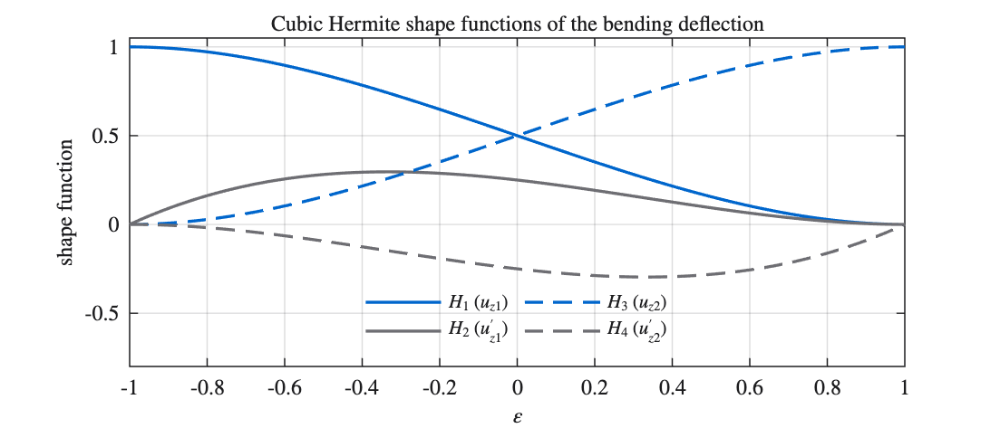</p>
<p align="center"><em>Cubic Hermite polynomials interpolate the bending deflection from the deflection and slope at the two nodes.</em></p>


The element matrices are the energies written in these coordinates. Stiffness is the strain energy of bending and torsion,
$$
K_{ij} = \int_L EI\, H_i''\, H_j''\,\mathrm{d}y + \int_L GJ\, N_i'\, N_j'\,\mathrm{d}y ,
$$

with $`H_i`$ the Hermite functions of the bending degrees of freedom and $`N_i`$ the linear functions of the twist. Mass is the kinetic energy. In the general case bending and torsion DOFs are coupled:

$$
M_{ij} = \int_L \bar\rho\, H_i H_j\,\mathrm{d}y + \int_L I_{Tym}\, N_i N_j\,\mathrm{d}y - \int_L I_{zm}\,\big(N_i H_j + H_i N_j\big)\,\mathrm{d}y .
$$

The last term is the coupling. A point of the section at chordwise position $`x`$ moves vertically by $`u_z - x\,\psi_y`$. A section whose mass centre is off the flexural axis therefore gains kinetic energy from the product of deflection rate and twist rate, weighted by the static mass moment $`I_{zm}`$. The minus sign is that kinematic relation: positive twist about the $`y`$ axis moves a point on the positive $`x`$ side (toward the leading edge) in the negative $`z`$ direction, which is up. This term makes the wind-off modes a mixture of bending and twist, and later lets the airflow feed one motion through the other.

Elements are assembled into the global matrices $`\mathbf K_{gg}`$ and $`\mathbf M_{gg}`$ (the subscript $`g`$ marks the physical FEM degrees of freedom), the three root degrees of freedom are clamped, and the eigenvalue problem

$$
\mathbf K_{gg}\,\boldsymbol\phi = \omega^2\,\mathbf M_{gg}\,\boldsymbol\phi
$$

gives the wind-off modes: 7.67 Hz, a bending mode, and 15.27 Hz, a torsion mode. The mode shapes are the columns of $`\boldsymbol\Phi_{gf}`$ (from physical DOFs $`g`$ to modal coordinates $`f`$). The modal coordinates $`\mathbf q_f`$, with $`\mathbf q_g = \boldsymbol\Phi_{gf}\,\mathbf q_f`$, are all the structure keeps from here on. In modal coordinates the mass and stiffness matrices are diagonal:

$$
\mathbf M_{ff} = \boldsymbol\Phi_{gf}^\top \mathbf M_{gg}\, \boldsymbol\Phi_{gf}, \qquad
\mathbf K_{ff} = \mathbf M_{ff}\,\mathrm{diag}(\omega_i^2), \qquad
\mathbf D_{ff} = \mathbf M_{ff}\,\mathrm{diag}(2\zeta\omega_i) ,
$$

where $`\mathbf D_{ff}`$ is a modal damping matrix built from the damping ratio $`\zeta`$, zero for this wing.

<p align="center">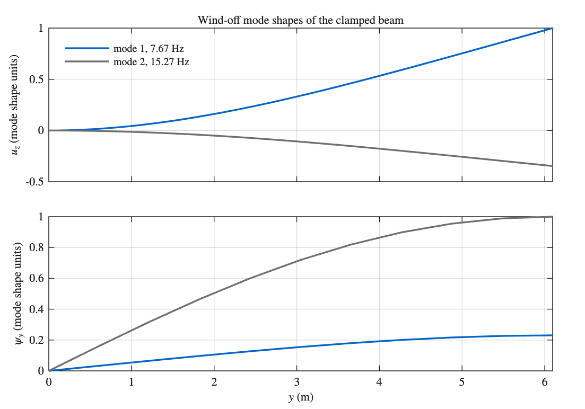</p>
<p align="center"><em>The two modes that flutter. Deflection <i>u<sub>z</sub></i> on top, twist <i>ψ<sub>y</sub></i> below. Mode 1 is mostly bending, mode 2 mostly torsion; the mass coupling gives each a little of the other.</em></p>

<details>
<summary>Derivation</summary>

**Shape functions.** Inside an element of length $`L`$ with nodes at $`y_1`$ and $`y_2`$, use the natural coordinate $`\varepsilon = 2(y - y_1)/L - 1 \in [-1, 1]`$. The bending functions are the cubic Hermite polynomials

$`\displaystyle H_1 = \tfrac14\,(2 - 3\varepsilon + \varepsilon^3), \quad H_2 = \tfrac{L}{8}\,(1 - \varepsilon - \varepsilon^2 + \varepsilon^3), \quad H_3 = \tfrac14\,(2 + 3\varepsilon - \varepsilon^3), \quad H_4 = \tfrac{L}{8}\,(-1 - \varepsilon + \varepsilon^2 + \varepsilon^3),`$

multiplying $`u_{z1}`$, $`u_{z1}'`$, $`u_{z2}`$, $`u_{z2}'`$ in that order ($`H_1`$ and $`H_3`$ are one at their own node and zero with zero slope at the other; $`H_2`$ and $`H_4`$ are zero at both nodes with unit slope at their own). The twist functions are $`N_1 = \tfrac12(1 - \varepsilon)`$ and $`N_2 = \tfrac12(1 + \varepsilon)`$. `build/beamPHI.m` evaluates the same six functions at arbitrary stations, which is how chapter 4 attaches panels and chapter 8 an accelerometer to the beam.

**Integration.** Both integrals are evaluated with the 4-point Gauss-Legendre rule on $`[-1, 1]`$, exact for the polynomials involved. The change of variable brings constant factors: $`\mathrm{d}y = (L/2)\,\mathrm{d}\varepsilon`$ for the mass integrals; for the bending stiffness two second derivatives contribute $`(2/L)^4`$, times the Jacobian, $`8/L^3`$ in total; for the torsional stiffness two first derivatives give $`(2/L)^2 \cdot L/2 = 2/L`$. `build/build_K_ele.m` and `build/build_M_ele.m` carry exactly these factors (`fact_b`, `fact_t`, `J`).

**Assembly and boundary condition.** `build/build_E_y.m` places the nodes and writes, for element $`e`$, the six global DOF numbers `ele{e} = [1 2 3 4 5 6] + 3(e-1)`. `build_Kgg` and `build_Mgg` add each element's $`6 \times 6`$ block into the rows and columns those numbers address (the direct stiffness method). The cantilever root is clamped by dropping the first three rows and columns before the eigenvalue solve, which `build/build_PHIgf.m` does with `Kgg(4:end,4:end)`; the three root entries of every mode shape are then put back as zeros.

**Normalisation.** `eigs` returns eigenvectors normalised so that $`\boldsymbol\phi^\top \mathbf M_{gg}\,\boldsymbol\phi = 1`$; `build_PHIgf` rescales every column so that its entry of largest magnitude is $`+1`$. The generalised mass matrix is then diagonal, because eigenvectors of a symmetric generalised eigenproblem are $`\mathbf M`$-orthogonal, but it is not the identity. The state and output scalings of chapters 9 and 12 (`sqrt(diag(Mff))`, `Kff(1,1)`) depend on this choice. With the columns scaled this way, $`q_{f1}`$ is about the tip deflection of the bending mode in metres.

</details>

**Source:** `build/build_E_y.m`, `build_K_ele.m`, `build_M_ele.m`, `build_Kgg.m`, `build_Mgg.m`, `build_PHIgf.m`, `beamPHI.m`. **Run it:** `TUTORIAL.m` section (2).

## 3. The aerodynamics: doublet lattice


<p align="center">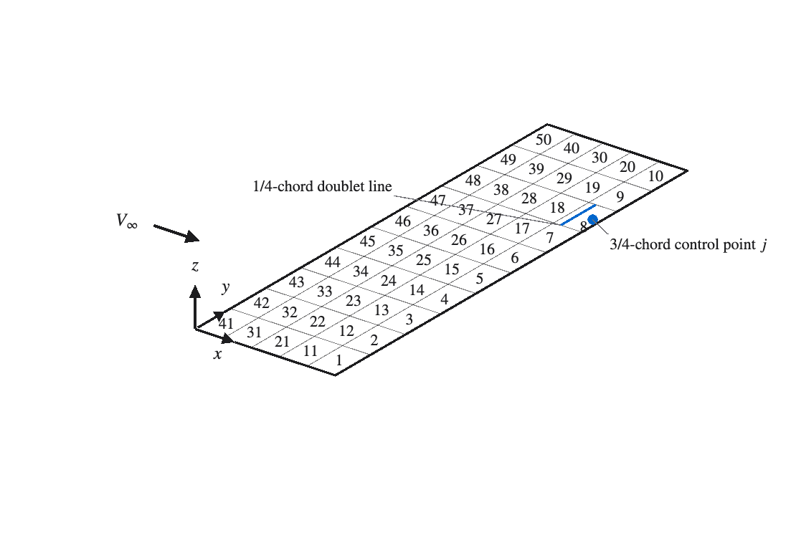</p>
<p align="center"><em>The aerodynamic grid in aerodynamic coordinates. Flow along the arrow. 5 panels along the chord, 10 along the span, numbered from the trailing-edge row inboard to the leading-edge row outboard. Every panel carries a line of pressure doublets at its quarter chord and enforces the flow boundary condition at one control point at three-quarter chord, marked on panel 8.</em></p>

The air loads come from the doublet-lattice method (DLM), the workhorse of industrial flutter analysis since Albano and Rodden published it in 1969. The DLM is a frequency domain method. It maps harmonically oscillating wing surfaces at a frequency $`\omega`$ in a freestream $`V_\infty`$, to harmonically oscillating pressure difference coefficients at the same frequency but with varying gain and phase per panel. The gain and phase shift is expressed as one complex number per possible transmission path per frequency. Each panel's flow condition transmits to each panel's pressure coefficient. Since the boundary condition at each panel's control point influences mostly its own pressure difference the resulting $`n_p \times n_p`$ matrices are diagonally dominant. The natural frequency variable is the reduced frequency

$$
k = \frac{\omega\, c_\mathrm{ref}}{2\,V_\infty},
$$

the phase the oscillation advances while the flow crosses half a chord. $`k \to 0`$ is quasi-steady.

The boundary condition is that the flow stays tangent to the moving surface. On panel $`j`$ it is imposed at the control point as a normalised downwash $`w_j = u_{z,j}/V_\infty`$, the vertical velocity of the surface there divided by the freestream. The DLM returns the pressure difference across each panel as a pressure coefficient. The map from downwash to pressure is the aerodynamic influence coefficient (AIC) matrix,

$$
\Delta \mathbf c_p(k) = \mathbf Q_{jj}(k)\, \mathbf w(k),
$$

one complex $`50 \times 50`$ matrix per reduced frequency (the subscript $`j`$ marks the panels). Complex, because at $`k \gt 0`$ the pressure lags the downwash: a real part in phase with the motion and an imaginary part in phase with its rate. 

<p align="center">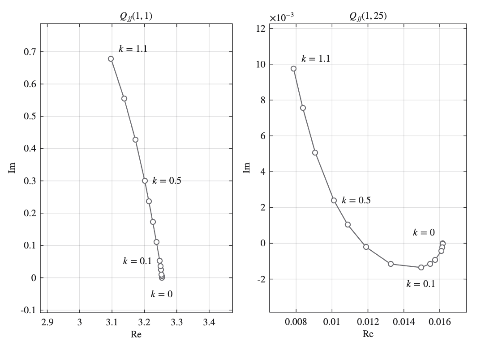</p>
<p align="center"><em>Two entries of <b>Q</b><sub>jj</sub>(<i>k</i>) traced over the 14 reduced frequencies in the complex plane: the pressure on panel 1 (trailing-edge row, root) per unit downwash on itself, and per unit downwash on panel 25 (middle row, mid span). At <i>k</i> = 0 both are real; as <i>k</i> grows the response acquires a phase lag and a changing magnitude. Chapter 5 fits these curves with a rational function of i<i>k</i>.</em></p>

<details>
<summary>Derivation</summary>

**The kernel.** Each panel carries a line of oscillating pressure doublets along its quarter chord, from the inboard point to the outboard point through the sending point at mid span. The normal velocity this line induces at the control point of any panel (three-quarter chord, mid span) is the integral along the line of the Albano-Rodden kernel function. The kernel depends on the relative position of the two points, on $`k`$ and on the Mach number through the Prandtl-Glauert factor $`\beta = \sqrt{1 - Ma^2}`$, equal to one here. The panels are flat and coplanar, so only the vertical velocity component matters. The integrand is singular and oscillatory; DLMpro approximates the doublet strength along the line by a quartic and the kernel's exponential integral by the Desmarais approximation, the standard choices (`build_Qjj` passes `"Quartic"` and `"Desmarais"`). FlutterWing does not touch the kernel: `DLMpro/` is vendored unmodified, and `build_Qjj` only prepares the geometry (corner points, control point `CP`, sending point `SP`, the doublet line ends `D1` and `D5`, the normal `N`, chord and width) and combines the results.

**Steady and unsteady parts.** At $`k = 0`$ the doublet line degenerates to the bound vortex of a horseshoe, so the steady influence is computed by a vortex-lattice routine (`VLM`) and the doublet-lattice routine (`DLM`) returns the oscillatory increment on top of it. `build_Qjj` calls both at every $`k`$ (the VLM part is cheap) and forms $`\mathbf D = -(\mathbf D_{VLM} + \mathbf D_{DLM})`$. The minus sign is DLMpro's convention for the direction of the induced velocity; the inverse then maps normalised downwash $`u_z/V_\infty`$ to $`\Delta p/\bar q`$ with $`\bar q = \tfrac12 \rho V_\infty^2`$ the dynamic pressure.

**Symmetry.** With `SYM = 1`, `build_Qjj` appends a mirror copy of every panel with $`y_a \to -y_a`$ and the corner order reversed so that the normal still points up. It solves the doubled problem and keeps $`\mathbf D_{rr} + \mathbf D_{rl}`$: the influence of the right half on itself plus the influence of the left half on the right, which is what a symmetric motion of both halves produces. The result is a $`50 \times 50`$ matrix that already knows about the other wing.

**Reduced frequency inside DLMpro.** DLMpro takes $`\omega/V_\infty`$; `build_Qjj` converts with `kred = k_red*2/c_ref`. The chord $`c_\mathrm{ref}`$ in $`k`$ is the full chord (1.8288 m), so $`k = \omega b / V_\infty`$ with $`b = c/2`$ the semichord of the textbooks.

</details>

**Source:** `build/build_PaPs.m` (panel corners, numbering), `build/build_Qjj.m` (geometry, symmetry, the calls into `DLMpro/`). **Run it:** `TUTORIAL.m` section (3).

## 4. Coupling the two grids and projecting onto modes

<p align="center">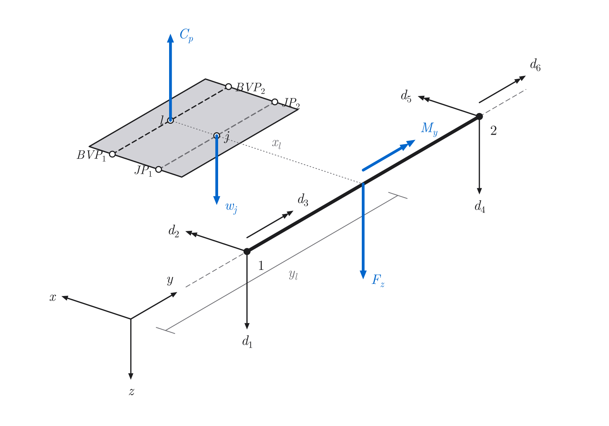</p>
<p align="center"><em>One beam element with its six degrees of freedom and one panel in the wing plane ahead of it; the rotations, the slopes about <i>x</i> and the twists about <i>y</i>, are the arrows with two heads. The pressure at the load point <i>l</i> on the quarter-chord line becomes a force and a moment at the beam station at the same span position, the lever arm <i>x</i><sub><i>l</i></sub> away. It reaches the six nodal degrees of freedom through the shape functions evaluated at <i>y</i><sub><i>l</i></sub>. In the other direction, the nodal motion moves the control point <i>j</i> on the three-quarter-chord line and sets its downwash. In blue: what the two grids exchange.</em></p>

The structure is defined in FEM deflections, the aerodynamics in panel pressures and downwash. Every point of the wing surface at chordwise position $`x`$ (structural frame) and span station $`y`$ "rides" on a rigid bar perpendicular to the beam, so its vertical position is

$$
z(x, y) = u_z(y) - x\,\psi_y(y):
$$

the beam's deflection plus the twist times the lever arm. 

**Pressure to force.** A pressure coefficient $`\Delta c_{p,j}`$ on panel $`j`$ is a force $`\bar q\, a_j\, \Delta c_{p,j}`$ at its load point, with $`a_j`$ the panel area and $`\bar q = \tfrac12\rho V_\infty^2`$ the dynamic pressure. The force acts on the beam station under the load point. The shape functions evaluated there determine how it splits over the nodal deflections and slopes, and the lever arm to the flexural axis defines the moment that splits over the nodal twists. Collected for all panels,

$$
\mathbf F_g = \bar q\, \mathbf S_{gj}\, \Delta \mathbf c_p ,
$$

with $`\mathbf S_{gj}`$ a $`33 \times 50`$ matrix (physical DOFs $`g`$ from panels $`j`$).

**Motion to downwash.** The downwash at the control point of panel $`j`$ has two parts. The steady part is the angle the surface presents to the flow, which for a flat plate on a twisting beam is the twist at that station. The unsteady part is the vertical velocity of the control point itself, $`\dot u_z - x_j \dot\psi_y`$, divided by $`V_\infty`$:

$$
\mathbf w = \mathbf D^{Re}_{jg}\, \mathbf q_g + \frac{1}{V_\infty}\, \mathbf D^{Im}_{jg}\, \dot{\mathbf q}_g .
$$

The names come from the frequency domain: for harmonic motion $`\dot{\mathbf q}_g = \mathrm{i}\omega\, \mathbf q_g`$, so the downwash is $`(\mathbf D^{Re}_{jg} + \mathrm{i}\,\tfrac{\omega}{V_\infty}\mathbf D^{Im}_{jg})\,\mathbf q_g`$, a real and an imaginary part.

**Why this is consistent.** Both directions use the same six shape functions of the same element: the force distribution is the transpose of the displacement interpolation. The work done by the panel pressures on a virtual displacement of the surface then equals the work done by the nodal forces on the corresponding virtual nodal displacement, so no energy is created or lost at the interface. This is the principle of virtual work. It is why the code needs no surface spline (the SPLINE cards of a NASTRAN deck): the beam's own basis is the interpolation.

**Onto the modes.** Everything is now projected onto the five mode shapes of chapter 2,

$$
\mathbf S_{fj} = \boldsymbol\Phi_{gf}^\top \mathbf S_{gj}, \qquad
\mathbf D^{Re}_{jf} = \mathbf D^{Re}_{jg}\, \boldsymbol\Phi_{gf}, \qquad
\mathbf D^{Im}_{jf} = \mathbf D^{Im}_{jg}\, \boldsymbol\Phi_{gf},
$$

which leaves $`5 \times 50`$ and $`50 \times 5`$ matrices. Together with $`\mathbf M_{ff}`$, $`\mathbf K_{ff}`$, $`\mathbf D_{ff}`$ and the mode shapes they fill the `Structure` dictionary; $`\mathbf Q_{jj}(k)`$, the reference chord and the air density go into `Aero`. Every `build_*` function downstream reads only these two structs, which is what makes the pipeline swappable: a bigger wing is a bigger pair of dictionaries.

<details>
<summary>Derivation</summary>

**Geometry of a panel** (`build/build_S_ele.m`, `build/build_DReDIm_ele.m`). The corners of panel $`j`$ in structural coordinates are `Ps{j}{1..4}` (leading-edge inboard, trailing-edge inboard, trailing-edge outboard, leading-edge outboard). The load point is the midpoint of the quarter-chord line, $`\mathbf l = \tfrac12(\mathbf{BVP}_1 + \mathbf{BVP}_2)`$ with $`\mathbf{BVP}_1 = 0.75\,\mathbf P_1 + 0.25\,\mathbf P_2`$ and likewise outboard. The control point is the midpoint of the three-quarter-chord line, $`\mathbf j = \tfrac12(\mathbf{JP}_1 + \mathbf{JP}_2)`$ with $`\mathbf{JP}_1 = 0.25\,\mathbf P_1 + 0.75\,\mathbf P_2`$. The panel normal is $`\mathbf N = (\mathbf P_2 - \mathbf P_1) \times (\mathbf P_4 - \mathbf P_1)`$, normalised; in the structural frame it points up, opposite to $`z_s`$. The width $`s_j`$ is the spanwise edge with its chordwise component removed, the area $`a_j = s_j c_j`$.

**Which element.** A panel is attached to the one element whose span contains its load point (force) or control point (downwash). With $`t = (\mathbf E_2 - \mathbf E_1)\cdot(\mathbf l - \mathbf E_1)/L^2`$, the element takes the panel when $`0 \lt t \le 1`$, so every panel is counted once, and the natural coordinate at that station is $`\varepsilon = 2t - 1`$.

**Force rows.** With the six shape functions $`S_1 \dots S_6`$ of chapter 2 evaluated at $`\varepsilon`$ (in the DOF order $`u_{z1}, u_{z1}', \psi_{y1}, u_{z2}, u_{z2}', \psi_{y2}`$), column $`j`$ of the element matrix is

$`\displaystyle \mathbf S_{ele}(:, j) = a_j\,\big[\, S_1\, (\mathbf N\cdot\mathbf z_s),\ S_2\, (\mathbf N\cdot\mathbf z_s),\ S_3\, \mathbf y_s\cdot((\mathbf l - \mathbf E_1)\times\mathbf N),\ S_4\, (\mathbf N\cdot\mathbf z_s),\ S_5\, (\mathbf N\cdot\mathbf z_s),\ S_6\, \mathbf y_s\cdot((\mathbf l - \mathbf E_1)\times\mathbf N)\,\big]^\top ,`$

the force along $`z_s`$ on the bending DOFs and the moment about $`y_s`$ (lever arm from the node to the load point, crossed with the force direction) on the twist DOFs. Because $`\mathbf N \cdot \mathbf z_s = -1`$, a positive pressure coefficient is a negative, that is upward, $`u_z`$ force: lift up.

**Downwash rows.** The steady rows carry only the twist DOFs, $`D^{Re}_{ele}(j, 3) = S_3\, (\mathbf y_s\cdot\mathbf S)`$ and $`D^{Re}_{ele}(j, 6) = S_6\, (\mathbf y_s\cdot\mathbf S)`$ with $`\mathbf S`$ the unit spanwise edge, so that $`w_j = \psi_y(y_j)`$ for a beam along $`y_s`$: a twisted section meets the flow at its twist angle. The rate rows are the vertical velocity of the control point: $`S_1, S_2, S_4, S_5`$ times $`(-\mathbf N\cdot\mathbf z_s)`$ for the bending DOFs and $`S_3, S_6`$ times $`-\mathbf N\cdot(\mathbf y_s \times (\mathbf j - \mathbf E_1))`$ for the twist DOFs, which is the lever arm $`x_j`$ with its sign. The projection onto $`-\mathbf N`$ turns "along $`z_s`$" into "downwash", positive when the surface moves down into the flow.

**Assembly.** `build_Sgj` and `build_DReDIm_jg` loop over the elements and add each element's block into the global rows or columns addressed by `ele{e}`, exactly as `build_Kgg` does. The literals `y_s = [0;1;0]` and `z_s = [0;0;1]` in these files are the basis vectors of the structural frame: the beam is along $`y_s`$ and the bar along $`x_s`$, which is the perpendicular-bar assumption. A swept beam would need a bar along the chord instead; that variant is not in this release.

</details>

**Source:** `build/build_S_ele.m`, `build_Sgj.m`, `build_DReDIm_ele.m`, `build_DReDIm_jg.m`; the dictionary layout is documented in the header of `define/define_Goland_Structure_Aero.m`. **Run it:** `TUTORIAL.m` section (4).

## 5. From frequency to time: Roger's RFA

<p align="center">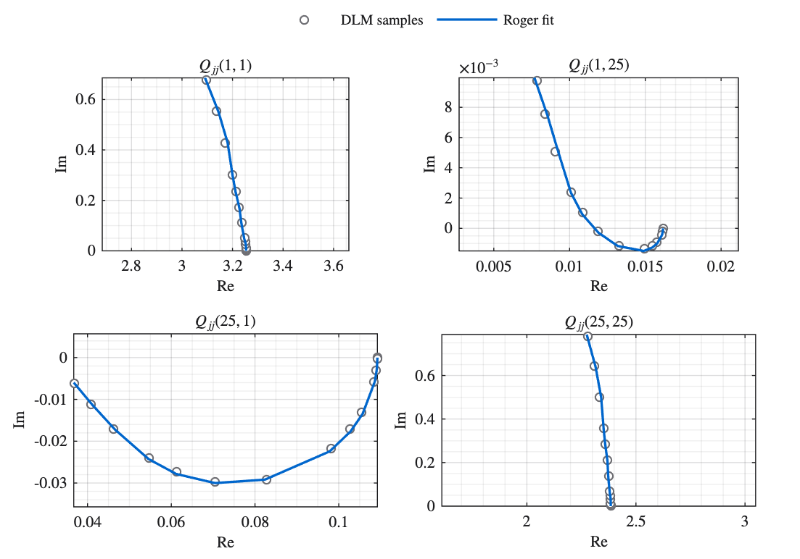</p>
<p align="center"><em>The 14 doublet-lattice samples (circles) and the Roger fit with six lag poles (line) for four entries of <b>Q</b><sub>jj</sub>: panels 1 and 25 on themselves and on each other. The fit passes through <i>k</i> = 0 exactly and follows the curves through the whole band.</em></p>

The doublet lattice gives the air loads as a table: one matrix per sampled reduced frequency, valid for harmonic motion only. A state-space model needs the loads as a function of the Laplace variable, so that any motion, growing, decaying or transient, can be simulated. Roger's rational function approximation (RFA) is the classic bridge. It fits every entry of the table with

$$
\hat{\mathbf Q}(k) = \mathbf Q_0 + \mathrm{i}k\, \mathbf Q_1 + \sum_{r=1}^{n_p} \mathbf A_r\, \frac{\mathrm{i}k}{\mathrm{i}k + p_r} ,
$$

a form with a physical reading. $`\mathbf Q_0`$ is the quasi-steady load, the table's entry at $`k = 0`$, taken over exactly. $`\mathrm{i}k\,\mathbf Q_1`$ grows with frequency: the part of the load in phase with the surface velocity. Each lag term is a first-order filter with a real pole $`p_r`$; together they give the load a memory of the motion a moment ago, which is the wake. The poles are not fitted but placed,

$$
p_r = \frac{k_{max}}{n_p,\ n_p - 1,\ \dots,\ 1}, \qquad n_p = 6,\ k_{max} = 1.1: \quad p_r = 0.18,\ 0.22,\ 0.28,\ 0.37,\ 0.55,\ 1.1 ,
$$

which keeps the fit linear in the unknowns $`\mathbf Q_1`$ and $`\mathbf A_r`$. At each sampled $`k \ne 0`$ the real and the imaginary part of one matrix entry give two real equations,

$$
\begin{bmatrix} 0 & \dfrac{k^2}{k^2 + p_r^2} \\ k & \dfrac{k\,p_r}{k^2 + p_r^2} \end{bmatrix}
\begin{bmatrix} Q_{1} \\ A_{r} \end{bmatrix} =
\begin{bmatrix} \mathrm{Re}\,(Q - Q_0) \\ \mathrm{Im}\,(Q - Q_0) \end{bmatrix}
\quad (r = 1 \dots n_p \text{ side by side}),
$$

so the 13 nonzero samples give 26 equations for 7 unknowns per entry, solved in the least-squares sense.

Modal projection reduces the state count. Realised in panel space, each lag term would need one state per panel, $`50 \times 6 = 300`$ aerodynamic states. Projected onto the modes first, as chapter 6 does, each lag term needs one state per mode: $`5 \times 6 = 30`$. The whole Goland wing then has 10 structural and 30 aerodynamic states.

`evalRFA` re-evaluates $`\hat{\mathbf Q}`$ at the 14 samples and reports three absolute errors: the largest deviation of any entry at any frequency, 0.0106; the largest root-mean-square deviation over frequency of any entry, 0.0052; and the root-mean-square deviation over all entries and frequencies, 0.00088, against entries of order one.

### Experiment: a cheaper fit

Take only six of the fourteen reduced frequencies and two poles instead of six, and fit again. Evaluated on all fourteen samples the errors grow to five to seven times the full fit.

<p align="center">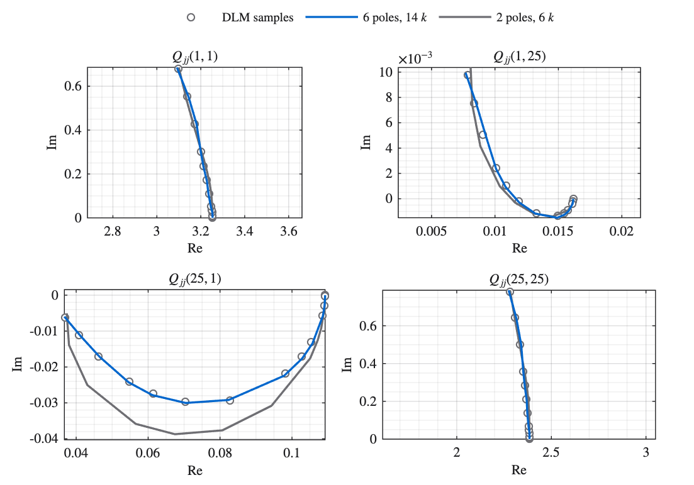</p>
<p align="center"><em>The same four entries with the full fit (blue) and the cheap fit, two poles on six samples (muted). The cheap fit stays on the large diagonal entries and drifts on the small off-diagonal ones, which carry the coupling between distant panels.</em></p>

As expected a less expressive fit is less accurate; however, what is accurate enough? Chapter 7 answers this question by comparing the cheap aerodynamics in `Aero_c` to the p-k method's flutter result as baseline.

<details>
<summary>Derivation</summary>

**Weighting.** Entries of $`\mathbf Q_{jj}`$ differ by orders of magnitude between panels close to and far from each other. `rogersRFA_magW` therefore weights every equation of an entry by $`1/\max(|Q_{ij}(k)|, 10^{-10})`$, the same weight for the real and the imaginary row, so that a small but dynamically important entry is fitted as carefully as a large one. The `magW` in the name is this magnitude weighting.

**The dropped term.** The general Roger form carries a third polynomial term $`-k^2 \mathbf Q_2`$; the code fixes $`\mathbf Q_2 = 0`$ and returns it as zeros. An apparent-mass contribution still exists in the model, because $`\mathrm{i}k\,\mathbf Q_1`$ multiplies a downwash that itself contains $`\mathrm{i}k`$ through $`\mathbf D^{Im}`$; chapter 6 shows where it lands.

**Two realisations.** `rogersRFA_magW` also returns the triple $`(\mathbf D, \mathbf E, \mathbf R)`$ of a panel-space realisation, $`\dot{\mathbf x}_L = \mathbf R\,\mathbf x_L + \mathbf E\,\dot{\mathbf u}`$, $`\mathbf y = \mathbf D\,\mathbf x_L + \mathbf Q_0\,\mathbf u + \mathbf Q_1\,\dot{\mathbf u}`$, with $`\mathbf R = \mathrm{diag}(-p_r) \otimes \mathbf I`$, $`\mathbf E`$ a stack of identities and $`\mathbf D = [\mathbf A_1 \cdots \mathbf A_{n_p}]`$. `evalRFA` uses it to evaluate the fit; the plant builders do not. `build_ABCD_G` assembles the lag states in modal coordinates from $`\mathbf A_r`$ (stored as `QLpjj`) and $`p_r`$ directly, which is the 30-state form.

**From $`k`$ to time.** The fit lives in the reduced Laplace variable $`\bar p = s\,c_\mathrm{ref}/(2V_\infty)`$, whose imaginary axis is $`\mathrm{i}k`$. A lag pole $`p_r`$ in $`\bar p`$ is a pole $`s_r = -p_r\, 2V_\infty/c_\mathrm{ref}`$ in physical time. The wake's time constants scale with the time the flow needs to cross the chord, so the same fit serves every airspeed and only its poles move with $`V_\infty`$. That factor $`2V_\infty/c_\mathrm{ref}`$ is `R_til` in `build_ABCD_G`.

</details>

**Source:** `rfa/rogersRFA_magW.m`, `util/evalRFA.m`, `util/fiterrs.m`, `util/mimo_nyquist.m`. **Run it:** `TUTORIAL.m` section (5).

## 6. Flutter analysis I: the p-method, the flutter mode

With the rational fit in hand the aeroelastic equations become an ordinary linear system. The state vector stacks the modal coordinates, their rates and the aerodynamic lag states,

$$
\mathbf x = \begin{bmatrix} \mathbf q_f \\ \dot{\mathbf q}_f \\ \mathbf x_L \end{bmatrix}, \qquad
\dot{\mathbf x} = \mathbf A(V_\infty)\,\mathbf x,
$$

40 states for the bare wing (10 structural, 30 aerodynamic), and $`\mathbf A`$ depends on the airspeed through the dynamic pressure and through the lag poles. The p-method is then one line per velocity: the eigenvalues of $`\mathbf A(V_\infty)`$ are the aeroelastic modes, their real parts the growth rates, their imaginary parts the frequencies. `build_ABCD_G` assembles $`\mathbf A`$ (and the $`\mathbf B`$, $`\mathbf C`$, $`\mathbf D`$ of chapter 8, zero placeholders for now). `getEigenvalueModeshape` calls `eig` at each of the 42 velocities and matches the eigenvalues from one velocity to the next by comparing eigenvectors, so that each row of its output is one mode followed across the grid. `Vg_plot` draws the rows between 3 and 20 Hz, the band of the two modes that matter, and finds the crossing.

<p align="center"></p>
<p align="center"><em>The p-method V-g plot on the 42-point grid from 20 to 190 m/s. The torsion frequency falls toward the bending frequency; the damping of the mode that becomes the flutter mode crosses zero at 164.8 m/s, 11.30 Hz.</em></p>

The comparison below follows Table 2 of Murua, Palacios and Graham (2010), including its attribution of 175.6 m/s to Goland. These are numerical benchmarks with different aerodynamic formulations and discretizations, rather than measurements of one physical wing.

| Reference | Method | Flutter speed |
|---|---|---|
| Goland (1945), as reported by Murua et al. | analytical | 175.6 m/s |
| Wang et al. (2006) | ZAERO (panel method) | 174.3 m/s |
| Wang et al. (2006) | UVLM | 163.8 m/s |
| Murua et al. (2010) | UVLM | 165 m/s |
| Murua et al. (2010) | UVLM with RFA | 177 m/s |
| this model | DLM, Roger RFA, p-method | 164.8 m/s |

References: J. Murua, R. Palacios and J. M. R. Graham, [*Modeling of Nonlinear Flexible Aircraft Dynamics Including Free-Wake Effects*](https://openresearch.surrey.ac.uk/esploro/outputs/conferencePresentation/Modeling-of-Nonlinear-Flexible-Aircraft-Dynamics/99511820602346), AIAA 2010-8226, Table 2; Z. Wang, P. C. Chen, D. D. Liu, D. T. Mook and M. J. Patil, [*Time Domain Nonlinear Aeroelastic Analysis for HALE Wings*](https://doi.org/10.2514/6.2006-1640), AIAA 2006-1640. The original benchmark is M. Goland, *The Flutter of a Uniform Cantilever Wing*, Journal of Applied Mechanics 12(4), A197-A208 (1945).

This model is close to the two UVLM results. Chapter 7 provides a separate check on its rational fit: the p-k method, which uses the doublet-lattice table directly, gives a flutter speed within 0.3 m/s. That comparison tests the fit on this grid; a convergence study would also vary the beam mesh, retained modes and panel grid.

The flutter mode itself is the eigenvector of the unstable pole. At 180 m/s the pole sits at 10.9 Hz with a growth of 42 % per cycle. Its eigenvector describes the amplitudes and phase relation of bending and twist. Their coupled motion lets the aerodynamic forces do positive net work over a cycle. Modal signs depend on the eigenvector convention; interpret the phase through the reconstructed physical motion.

### Experiment: move the mass axis

The mass coupling of chapter 2 ties bending to twist inside the structure. Move the mass axis from 0.43 to 0.30 of the chord, ahead of the flexural axis at 0.33, and $`I_{zm}`$ changes sign. Only the mass matrix changes, so the rebuild is cheap: new $`\mathbf M_{gg}`$, new modes, new projection, the aerodynamics untouched.

<p align="center">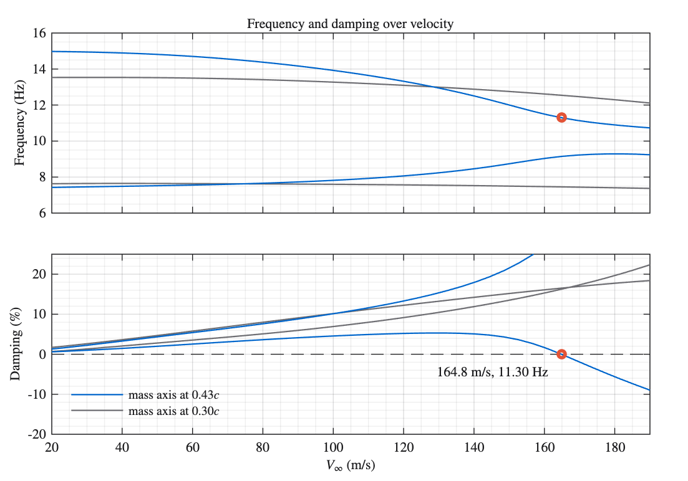</p>
<p align="center"><em>Mass axis at 0.43 c (blue) against 0.30 c (grey). With the mass axis ahead of the flexural axis the torsion mode starts lower, at 13.5 Hz, the two frequencies never approach, and the damping of both modes grows with velocity.</em></p>

With the mass axis at 0.30 c there is no flutter: the damping of both modes rises with velocity instead of turning down. This is mass balancing, the classical passive cure for flutter. With the mass centre ahead of the flexural axis, the inertia of an accelerating section twists it the other way, and the airflow can no longer feed the twist through the bending. Try the other knobs while the script is open: sweep `xm`, give the wing structural damping through `dampRatio`, or stiffen it through `GI_Tya`.

<details>
<summary>Derivation</summary>

**The system matrix.** Insert the Roger fit (chapter 5) into the generalised aerodynamic force $`\bar q\,\mathbf S_{fj}\,\hat{\mathbf Q}(\bar p)\,\mathbf w`$ with the downwash of chapter 4, $`\mathbf w = (\mathbf D^{Re}_{jf} + \tfrac{2\bar p}{c_\mathrm{ref}}\mathbf D^{Im}_{jf})\,\mathbf q_f`$ in the reduced Laplace variable $`\bar p = s\,c_\mathrm{ref}/(2V_\infty)`$, and sort the terms by the power of $`s`$ they carry. The polynomial part of the fit gives modified structural matrices ($`\tfrac12\rho V_\infty^2 = \bar q`$):

$`\displaystyle \tilde{\mathbf M}_{ff} = \mathbf M_{ff} - \tfrac12\rho\, \mathbf S_{fj}\,\mathbf Q_1\,\tfrac{c_\mathrm{ref}}{2}\,\mathbf D^{Im}_{jf},`$

$`\displaystyle \tilde{\mathbf K}_{ff} = \tfrac12\rho V_\infty^2\, \mathbf S_{fj}\Big(\mathbf Q_0\,\mathbf D^{Re}_{jf} + \sum_r \mathbf A_r\big(\mathbf D^{Re}_{jf} - \tfrac{2 p_r}{c_\mathrm{ref}}\mathbf D^{Im}_{jf}\big)\Big) - \mathbf K_{ff},`$

$`\displaystyle \tilde{\mathbf D}_{ff} = \tfrac12\rho V_\infty\, \mathbf S_{fj}\Big(\mathbf Q_0\,\mathbf D^{Im}_{jf} + \mathbf Q_1\,\tfrac{c_\mathrm{ref}}{2}\,\mathbf D^{Re}_{jf} + \sum_r \mathbf A_r\,\mathbf D^{Im}_{jf}\Big) - \mathbf D_{ff}:`$

the apparent mass from $`\mathbf Q_1`$ acting on the rate part of the downwash, an aerodynamic stiffness and an aerodynamic damping (the code's `Mff_til`, `Kff_til`, `Dff_til`). They carry the structural matrices with a minus sign, so that $`\ddot{\mathbf q}_f = \tilde{\mathbf M}_{ff}^{-1}(\tilde{\mathbf K}_{ff}\,\mathbf q_f + \tilde{\mathbf D}_{ff}\,\dot{\mathbf q}_f + \dots)`$. What is left of each lag term after the polynomial parts are split off, $`-\mathbf A_r\,\big[p_r \mathbf D^{Re}_{jf} - \tfrac{2}{c_\mathrm{ref}} p_r^2\, \mathbf D^{Im}_{jf}\big]\,\mathbf q_f/(\bar p + p_r)`$, is realised by five lag states per pole (one per mode) with

$`\displaystyle \dot{\mathbf x}_{L,r} = -\frac{2V_\infty}{c_\mathrm{ref}}\,p_r\,\mathbf x_{L,r} + \tfrac12\rho V_\infty^3\,\mathbf S_{fj}\,\mathbf A_r\Big(\mathbf D^{Im}_{jf}\big(\tfrac{2p_r}{c_\mathrm{ref}}\big)^2 - \mathbf D^{Re}_{jf}\,\tfrac{2p_r}{c_\mathrm{ref}}\Big)\,\mathbf q_f ,`$

and every lag state adds directly to the generalised force. Written as blocks, with $`\tilde{\mathbf R} = \mathrm{diag}(-p_r)\otimes\mathbf I \cdot 2V_\infty/c_\mathrm{ref}`$, $`\tilde{\mathbf D} = [\mathbf I\ \cdots\ \mathbf I]`$ and $`\tilde{\mathbf E}`$ the stacked input rows above,

$`\displaystyle \mathbf A(V_\infty) = \left[\ \begin{matrix} \mathbf 0 \\ \tilde{\mathbf M}_{ff}^{-1}\tilde{\mathbf K}_{ff} \\ \tilde{\mathbf E} \end{matrix} \quad \begin{matrix} \mathbf I \\ \tilde{\mathbf M}_{ff}^{-1}\tilde{\mathbf D}_{ff} \\ \mathbf 0 \end{matrix} \quad \begin{matrix} \mathbf 0 \\ \tilde{\mathbf M}_{ff}^{-1}\tilde{\mathbf D} \\ \tilde{\mathbf R} \end{matrix}\ \right] .`$

Because the lag states add to the force, they carry the units of a generalised force. That is why the entry points of chapter 9 scale them by $`\bar q_\mathrm{ref}\, c_\mathrm{ref}^2`$.

**Tracking.** `getEigenvalueModeshape` takes the $`\dot{\mathbf q}_f`$ rows of the right eigenvectors at two consecutive velocities and pairs the eigenvalues with `eigenshuffle` (a Hungarian assignment on eigenvalue distance and eigenvector alignment). The rows are then sorted by descending real part at the first velocity, so the least damped modes come first. Pass the `ss` model as built: a balanced or minimal realisation would reorder the states and silently break the row selection.

</details>

**Source:** `build/build_ABCD_G.m`, `util/getEigenvalueModeshape.m`, `util/eigenshuffle/`, `util/Vg_plot.m`, `util/animate_wing.m`. **Run it:** `TUTORIAL.m` section (6); the animation plays in a figure window there.

## 7. Flutter analysis II: the p-k method as reference

<p align="center">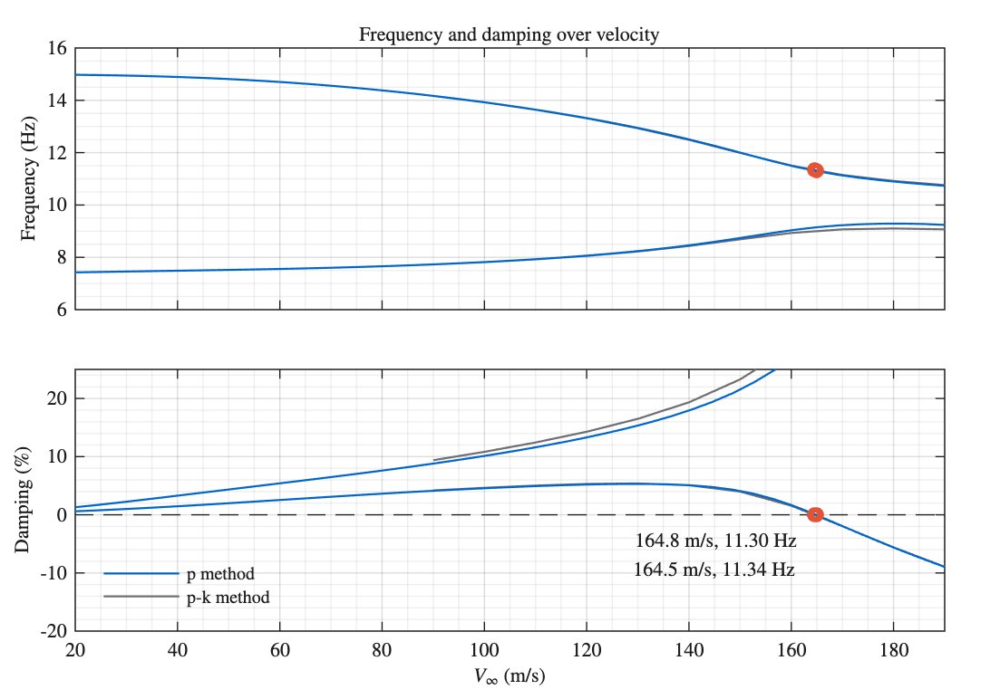</p>
<p align="center"><em>The p-method of chapter 6 (blue, 42 velocities, seconds) against the p-k method (grey, 11 velocities, 9 s): the curves lie on top of each other, and the crossings differ by 0.3 m/s.</em></p>

The p-method is fast because it does not run the doublet lattice method after the initial fit. The classical way, avoiding the time-domain altogether, is the p-k method. Start from the modal equation of motion with the aerodynamic force on the right,

$$
\mathbf M_{ff}\,\ddot{\mathbf q}_f + \mathbf D_{ff}\,\dot{\mathbf q}_f + \mathbf K_{ff}\,\mathbf q_f = \bar q\,\mathbf Q_{ff}(k)\,\mathbf q_f, \qquad
\mathbf Q_{ff}(k) = \mathbf S_{fj}\,\mathbf Q_{jj}(k)\,\Big(\mathbf D^{Re}_{jf} + \mathrm{i}\,\tfrac{2k}{c_\mathrm{ref}}\,\mathbf D^{Im}_{jf}\Big),
$$

the AIC table sandwiched between the coupling matrices. Its real part acts as a stiffness and its imaginary part, for harmonic motion at $`\omega`$, as a damping: $`\mathrm{i}\,\bar q\,\mathbf Q_{Im}\,\mathbf q_f = \bar q\,\mathbf Q_{Im}\,\dot{\mathbf q}_f/\omega`$. Seeking $`\mathbf q_f \propto e^{pt}`$ gives the aeroelastic eigenproblem

$$
\Big[\,\mathbf M_{ff}\,p^2 + \big(\mathbf D_{ff} - \bar q\,\mathbf Q_{Im}/\omega\big)\,p + \big(\mathbf K_{ff} - \bar q\,\mathbf Q_{Re}\big)\Big]\,\mathbf x = \mathbf 0 .
$$

The "argument" is however circular: $`\mathbf Q_{ff}`$ depends on the reduced frequency, $`k = \omega\,c_\mathrm{ref}/(2V_\infty)`$ depends on the frequency of the mode, and that frequency is the answer. The solution is iterative. Guess $`k`$, evaluate the aerodynamics there (one doublet-lattice solve), solve the eigenproblem, read the mode's $`p`$, set $`k_{n+1} = |\mathrm{Im}\,p_n|\,c_\mathrm{ref}/(2V_\infty)`$, and repeat until $`k`$ stops moving. Because the eigenvalues come out of `eig` in no particular order, the mode is followed through the iterations and across the velocities with `eigenshuffle`, the same matching the p-method uses.

The two flutter methods must agree: the p-k method puts the crossing at 164.5 m/s and 11.34 Hz, the p-method at 164.8 m/s and 11.30 Hz, 0.3 m/s apart. That agreement is the first thing to verify on any new wing: a fit that has gone wrong shows up as a gap between the two curves.

### Experiment: the cheap fit meets the referee

Chapter 5 kept the two-pole, six-sample fit in `Aero_c`. Run the p-method with it (the p-k result does not depend on any fit, so it needs no rerun) and compare all three.

<p align="center">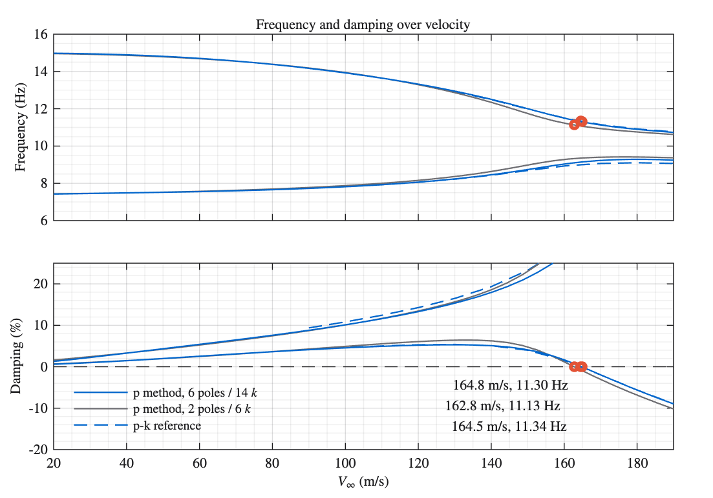</p>
<p align="center"><em>The p-method with the six-pole fit (blue), with the two-pole fit on six samples (grey), and the p-k reference (blue dashed). The cheap fit's curve sits slightly above the reference in damping between 120 and 160 m/s and crosses zero 2 m/s earlier, at 162.8 m/s; the full fit and the p-k reference are indistinguishable.</em></p>

The coarse aerodynamics move the flutter speed from 164.8 to 162.8 m/s, a change of 2 m/s or 1.2 %, and the flutter frequency from 11.30 to 11.13 Hz, while the six-pole fit reproduces the p-k reference to 0.3 m/s. For this wing the cheap fit would still be a usable estimate.

<details>
<summary>Derivation</summary>

**The matrices as coded.** With $`\mathbf Q_{jj}(k) = \mathbf Q_{Re} + \mathrm{i}\,\mathbf Q_{Im}`$ and $`\omega = 2V_\infty k/c_\mathrm{ref}`$, `pkmethode` forms

$`\displaystyle \tilde{\mathbf Q}_{Re} = \bar q\,\mathbf S_{fj}\Big(\mathbf Q_{Re}\,\mathbf D^{Re}_{jf} - \tfrac{\omega}{V_\infty}\,\mathbf Q_{Im}\,\mathbf D^{Im}_{jf}\Big), \qquad \tilde{\mathbf Q}_{Im} = \bar q\,\mathbf S_{fj}\Big(\tfrac{1}{\omega}\,\mathbf Q_{Im}\,\mathbf D^{Re}_{jf} + \tfrac{1}{V_\infty}\,\mathbf Q_{Re}\,\mathbf D^{Im}_{jf}\Big),`$

the real and the imaginary part of $`\bar q\,\mathbf Q_{ff}`$ with the downwash written as $`\mathbf D^{Re}_{jf} + \mathrm{i}\,\tfrac{\omega}{V_\infty}\mathbf D^{Im}_{jf}`$, the imaginary part divided by $`\omega`$ so that it multiplies $`\dot{\mathbf q}_f`$. The eigenproblem is then the first-order companion form

$`\displaystyle \mathbf A = \left[\ \begin{matrix} \mathbf 0 \\ \mathbf M_{ff}^{-1}(\tilde{\mathbf Q}_{Re} - \mathbf K_{ff}) \end{matrix} \quad \begin{matrix} \mathbf I \\ \mathbf M_{ff}^{-1}(\tilde{\mathbf Q}_{Im} - \mathbf D_{ff}) \end{matrix}\ \right],`$

ten states, solved with `eig`.

**The iteration.** For each velocity and each of the ten eigenvalues, starting from the wind-off solution ($`k = 0`$, sorted by magnitude), the loop `while |Im p| c_ref/(2 V) - k > 1e-3` updates $`k`$, calls `build_Qjj` at that single $`k`$, rebuilds $`\mathbf A`$, solves, and picks the eigenvalue that continues the current mode with `eigenshuffle`. The tolerance is absolute. The loop has no iteration cap, so a mode whose $`k`$ refuses to settle would hang the call (it does not happen on either shipped wing). One guard matters: if a mode's frequency collapses to zero, $`k = 0`$ and the division by $`\omega`$ in $`\tilde{\mathbf Q}_{Im}`$ would produce `NaN`. The loop then breaks and keeps the last valid eigenvalue.

**What the p-k method assumes.** The damping substitution $`\mathrm{i}\,\mathbf Q_{Im} \to \mathbf Q_{Im}/\omega\cdot p`$ is exact only for undamped harmonic motion; away from the zero crossing the p-k damping values are approximate. The crossing itself, where $`\mathrm{Re}\,p = 0`$, is exact, which is why the method is the reference for the flutter speed and not for the damping curves.

</details>

**Source:** `util/pkmethode.m` (Ma = 0 and SYM = 1 fixed inside; must match the define file), `util/eigenshuffle/`. **Run it:** `TUTORIAL.m` section (7).

## 8. Control surface, accelerometer, actuator

**Flap.** A control surface is a list of panels plus a hinge line, given by two points in aerodynamic coordinates. For the benchmark these are the outer three panels of the trailing-edge row and the line from the inboard leading-edge corner of panel 8 ($`\mathbf{RP}_1`$) to the outboard one of panel 10 ($`\mathbf{RP}_2`$), the grey surface of the chapter 1 figure. Deflecting it by an angle $`u_x`$ tilts those panels and moves their control points, so the flap enters the aerodynamics as a localized downwash boundary condition:

$$
\mathbf w = \mathbf D^{Re}_{jx}\,u_x + \frac{1}{V_\infty}\,\mathbf D^{Im}_{jx}\,\dot u_x, \qquad
D^{Re}_{jx} = \mathbf r\cdot\mathbf S_j, \quad D^{Im}_{jx} = -\mathbf N_j\cdot\big(\mathbf r\times(\mathbf j - \mathbf{RP}_1)\big),
$$

with $`\mathbf r`$ the unit hinge vector, $`\mathbf S_j`$ the panel's spanwise direction, $`\mathbf N_j`$ its normal and $`\mathbf j`$ its control point. The steady term is the tilt of the surface, the rate term the vertical velocity of the control point swinging about the hinge. The sign convention follows from the hinge direction: a positive deflection is the trailing edge down. The columns of $`\mathbf D^{Re}_{jx}`$ and $`\mathbf D^{Im}_{jx}`$ are then multiplied by the same aerodynamics as the structural downwash, which is how a flap command reaches the modal equations.

**Accelerometer.** The sensor is an inertial measurement unit, here a single-axis accelerometer, that reads the vertical acceleration of the point it sits on. By the rigid-bar kinematics of chapter 4,

$$
\ddot u_{z,IMU} = \ddot u_z(y) - x_{IMU}\,\ddot\psi_y(y),
$$

which `build_IMU` writes as a row $`\boldsymbol\Phi_{zg}`$ over the physical degrees of freedom (subscript $`z`$ for sensors), evaluated through the shape functions at the sensor's span station and multiplied by the lever arm at its chord position. The reading is along $`z_s`$, so a wing that accelerates upward reads a negative value. The sensor sits at the hinge midpoint, 0.8 chord from the leading edge at 85 % of the span, where both the bending and the twist of the flutter mode are visible.

**Actuator.** A commanded deflection is not an instant deflection. Control surfaces are driven by servos whose bandwidth is of the order of the frequencies of flutter, so the actuator model is not optional! The simplest one that is not too simple is second order,

$$
G_{act}(s) = \frac{K\,\omega_0^2}{s^2 + 2\,d\,\omega_0\,s + \omega_0^2}, \qquad K = 1,\quad d = 0.9,\quad \omega_0 = 2\pi\cdot 32\ \mathrm{rad/s},
$$

from the demanded angle to the actual one, well damped ($`d = 0.9`$) with a 32 Hz bandwidth. It is realised as a two-state model whose outputs are the deflection, its rate and its acceleration, because the aerodynamics needs all three: the deflection drives $`\mathbf D^{Re}_{jx}`$, the rate $`\mathbf D^{Im}_{jx}`$, and the acceleration the apparent-mass term. Its rate state is scaled by $`\omega_0`$ (`StateScale = [1; w0]`) so that both states stay of comparable size.

<p align="center">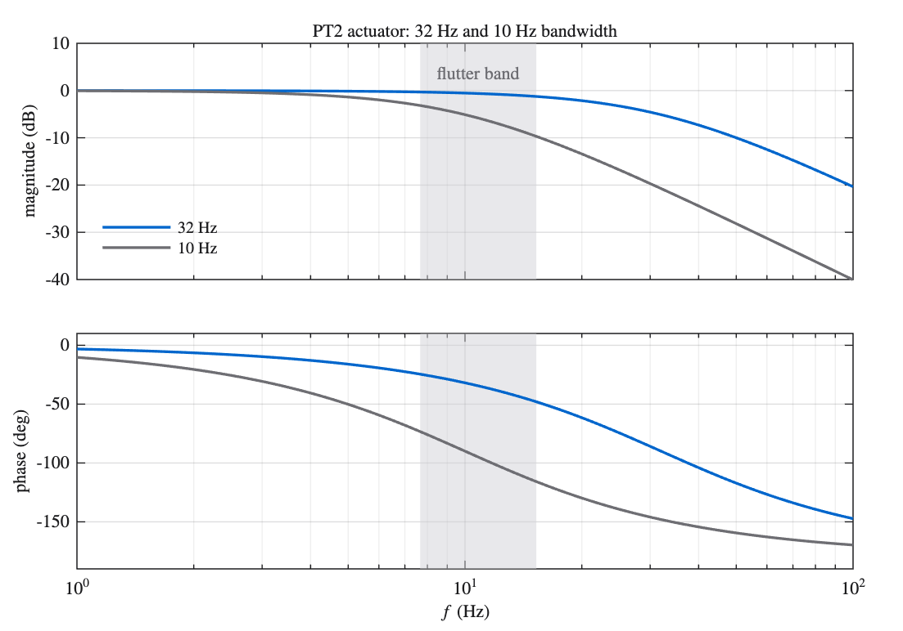</p>
<p align="center"><em>The actuator's frequency response at 32 Hz (blue) and, for chapter 10's experiment, at 10 Hz (grey); the band between the two wind-off frequencies of the wing is shaded. At the flutter frequency of 11.3 Hz the 32 Hz servo delivers 92 % of the demanded angle 36 degrees late; the 10 Hz servo delivers 49 %, 98 degrees late.</em></p>

A typical actuator model must include deflection and rate limits. Both are missing from this linear model for now.

<details>
<summary>Derivation</summary>

**Hinge line from panel corners.** The define file takes the hinge of a trailing-edge surface as the leading edge of its panel block, from corner 1 (leading-edge inboard) of the first panel to corner 4 (leading-edge outboard) of the last. For the Goland flap that is `Pa{8}{1}` to `Pa{10}{4}`. The rotation is positive about that vector by the right-hand rule, and with $`\mathbf r`$ pointing outboard that rotation moves the trailing edge, which lies downstream of the hinge, downward. For a leading-edge surface (the slats of the research wing) the hinge is the trailing edge of the block, and the define file lists its two points in the opposite order, `Pa{last}{3}` to `Pa{first}{2}`, so that $`\mathbf r`$ points inboard. That reversal is deliberate: with it, a positive slat deflection moves the leading edge down too, and one sign convention, positive is edge down, holds for every surface. The rate term $`\mathbf D^{Im}_{jx}`$, the downward velocity of the control point per unit rate, comes out positive for all eight surfaces of the research wing, which is the numerical form of that statement (checked in `CONVENTIONS.md`).

**One bar for sensor and aerodynamics.** `build_IMU` and `build_DReDIm_ele` use the same kinematics, $`z = u_z - x\,\psi_y`$, the same shape functions (`beamPHI`) and the same lever-arm sign. That is what makes the accelerometer reading consistent with the forces: the sensor sees the same surface the aerodynamics acts on. An accelerometer anywhere on the wing is one call, `build_IMU(x_pos, y_pos, E, ele)` with the position in structural coordinates; chapter 10 moves it.

**The zeroed feedthrough.** The apparent-mass term of the flap acceleration, $`\tfrac12\rho\,\mathbf S_{fj}\,\mathbf Q_1\,\tfrac{c_\mathrm{ref}}{2}\,\mathbf D^{Im}_{jx}`$, is set to zero in `build_ABCD_G` on purpose (the exact expression is kept in a comment). The actuator's acceleration output has a direct term, so keeping it would give the plant a nonzero $`\mathbf D`$ matrix from the demand to the accelerometer. That is an instantaneous path that no real sensor sees, and several tools of this repository (`simulate_afs_switch`, the flutter-mode animation) assume it to be absent.

</details>

**Source:** `build/build_DReDIm_jx.m`, `build/build_IMU.m`, `build/beamPHI.m`, `define/define_PT2Actuator.m`; the hinge and sensor definitions at the end of `define/define_Goland_Structure_Aero.m`. **Run it:** `TUTORIAL.m` section (8).

## 9. The plant G and why AFS is hard

<p align="center">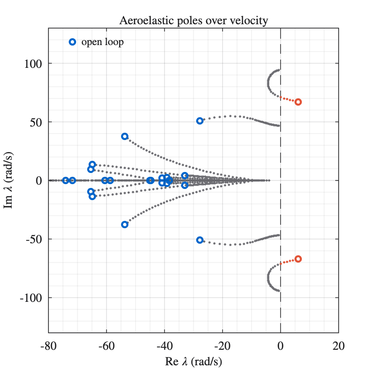</p>
<p align="center"><em>The poles of the plant at every velocity of the grid, 20 to 190 m/s (muted dots), and at 190 m/s (blue circles). The two structural pairs start near their wind-off frequencies on the imaginary axis (the wing has no structural damping) and move left as the air damps them. Then one pair turns back and crosses into the right half plane: flutter.</em></p>

The previous chapters have treated the coupling of the aerodynamics to the structure, the vertical acceleration measurements, the integration of control surface deflections as localized boundary conditions on the panel downwash, and the simplest suitable actuator model. It is now time to stitch it all together. The resulting aeroservoelastic plant $`G`$ takes flap command inputs and outputs accelerometer readings. The plant is assembled at `build_G_Goland(V_inf, 1, 1)`.

**Scaling.** The raw matrices of `build_ABCD_G` mix metres, radians and generalised forces; for numerical reasons a diagonal state and output scaling is introduced.

$$
\tilde{\mathbf A} = \mathbf S_x^{-1}\mathbf A\,\mathbf S_x, \qquad \tilde{\mathbf B} = \mathbf S_x^{-1}\mathbf B, \qquad \tilde{\mathbf C} = \mathbf S_o^{-1}\mathbf C\,\mathbf S_x, \qquad \tilde{\mathbf D} = \mathbf S_o^{-1}\mathbf D,
$$

with `StateScale = [1 (five modal coordinates); OMEGA (five rates); q_bar_ref*c_ref^2 (thirty lag states)]` and `OutScale = Kff(1,1)/Mff(1,1)`, which is $`\omega_1^2`$: the accelerometer output is measured in units of mode 1's acceleration at unit amplitude. The state scaling is a similarity transform for numerical reasons only. The output scaling does change the units of $`y`$, and the shipped controllers were tuned on the scaled measurement, so keep it. The `V_inf_ref = 100` inside the builders enters only through $`\bar q_\mathrm{ref}`$ in the lag-state scale; it is not the velocity of the model.

**Names.** The scaled model gets `StateName` (`q_f1` to `q_f5`, `q_f1_dot` to `q_f5_dot`, `aero_lag1` to `aero_lag30`), the three actuator-side inputs `flap1`, `flap1_dot`, `flap1_ddot` and the output `u_z1_ddot`.

**Actuator in.** `connect` wires the actuator's three outputs to those three inputs by name and returns the model from `flap1_d`, the demanded deflection, to `u_z1_ddot`. The result has 42 states, one input and one output, one `ss` per velocity, stacked into an `ss` array over the grid. 

### Why active flutter suppression is hard

The pole map shows how the dynamics change with velocity:

- The dynamics depend strongly on the freestream velocity, and in a real aircraft on the flight condition and the loading (fuel, payload) as well.
- This Goland model has 42 states. Industrial models have several hundreds.
- The 30 aerodynamic lag states have no direct physical interpretation and cannot be measured.
- The supplied sensor models measure accelerations, so modal deflections and rates are not available as direct feedback signals.
- Each control surface excites several aeroelastic modes at once with varying gain and lag per frequency and freestream velocity.
- A feedback from distributed accelerations to control-surface deflections has no intuitive connection to the modes it is supposed to damp.
- Controller design also has to account for measurement noise, unintended interference with the rigid body dynamics (primary flight controller) and avoid excessive control activity.

**Source:** `build/build_G_Goland.m` (the scaling, the names, the `connect` loop), `build/build_ABCD_G.m`; `util/pole_plot.m`. **Run it:** `TUTORIAL.m` section (9).

## 10. Closing the loop

Let's now do control. Feedback control to be precise.

<p align="center">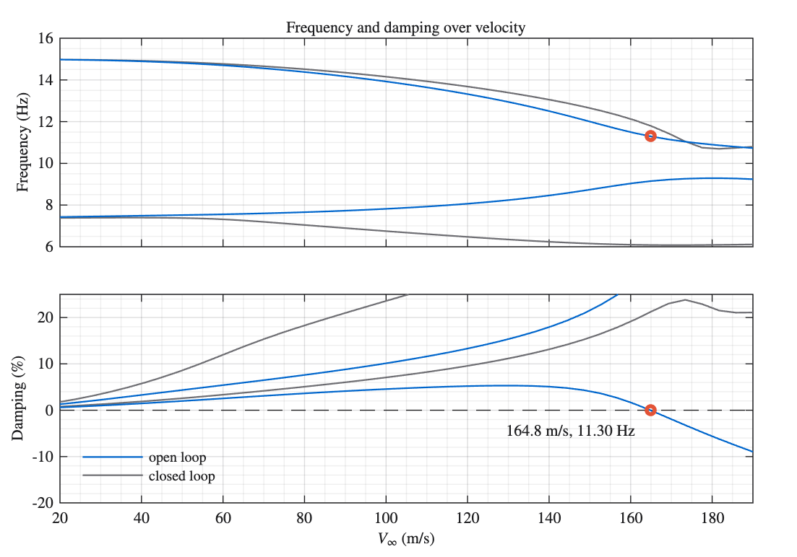</p>
<p align="center"><em>Open loop (blue) and closed loop with the shipped controller (muted) over the same 42 velocities. The open loop crosses zero damping at 164.8 m/s; the closed loop keeps every mode in the band damped up to 190 m/s. </em></p>

```matlab
CL = feedback(G, -Goland_Cont_nO);        % u = K*y
```

Closes the loop from acceleration measurements to control surface deflection commands using the provided linear controller. Note the minus sign. MATLAB's `feedback(G, K)` uses negative feedback, $`u = -K\,y`$. The supplied controllers use $`u = K\,y`$, the convention of `lft(P, K)`.

`CL` is an `ss` array over the same velocities as `G`, so `getEigenvalueModeshape` and `Vg_plot` apply as before. Every sampled model is stable through 190 m/s. Above 160 m/s the former flutter mode has at least 20 % damping; the bending mode gains damping and its frequency moves toward 6 Hz. The pole map shows the result at 190 m/s.

<p align="center">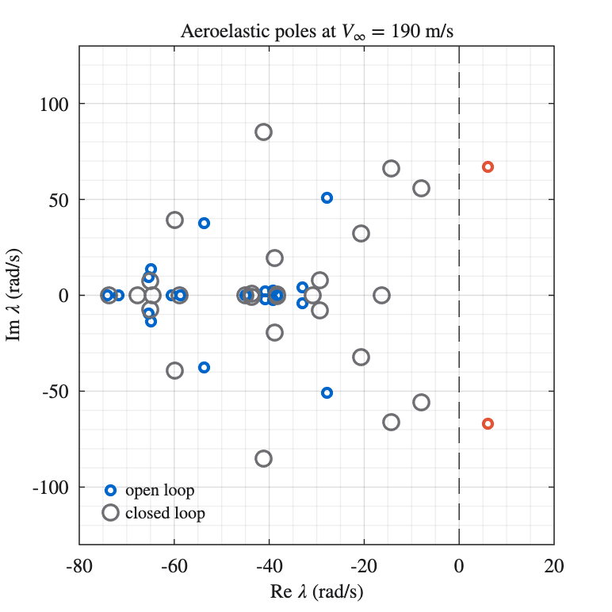</p>
<p align="center"><em>Poles at 190 m/s, open loop (blue rings) and closed loop (larger grey rings, so that a pole both loops share shows both). The unstable pair has moved into the left half plane; the other poles barely move, which is what a controller that targets one mode should do.</em></p>

The synthesis script `R00_Synthesize_Goland_Controller.m` ends with the same test in code: it rebuilds the plant on `linspace(20,190,42)`, closes the loop and asserts that every closed-loop eigenvalue at every velocity has a negative real part.

### Experiment: a slower actuator and other sensor positions

The loop above is the one the controller was designed for: a 32 Hz servo and the accelerometer at the flap hinge. The actuator and the sensor position are two things a control engineer does not get to choose freely, so keep the controller and change those instead. First the servo bandwidth from 32 to 10 Hz, the same second-order model with $`\omega_0 = 2\pi\cdot 10`$: at the flutter frequency it now delivers half the demanded angle almost a quarter cycle late (chapter 8). Then, back at 32 Hz, the accelerometer moved 0.3 chord toward the leading edge, and, separately, to mid span at the hinge's chord position. Each variant is a new plant with the same controller.

<p align="center">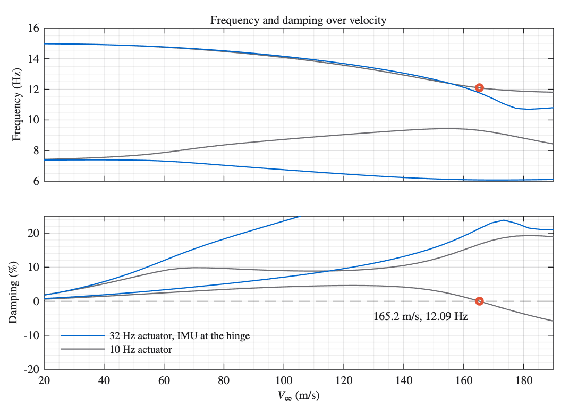</p>
<p align="center"><em>The same controller on the 32 Hz actuator it was designed for (blue) and on a 10 Hz actuator (muted): with the slow servo the damping of the flutter mode falls back to zero at 165.2 m/s, 12.1 Hz.</em></p>

<p align="center">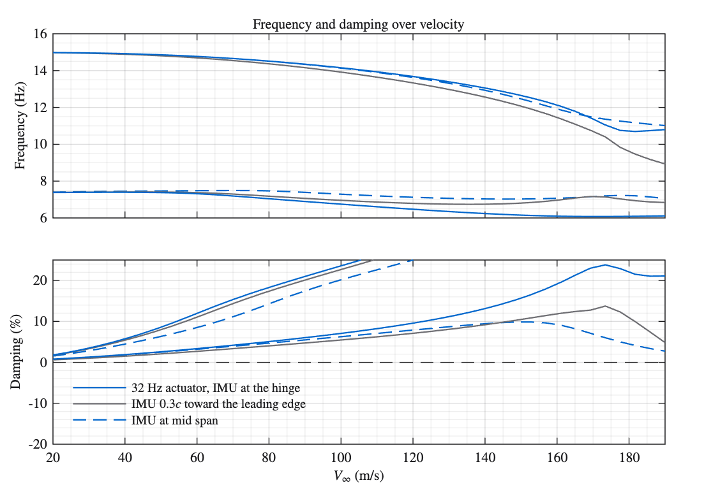</p>
<p align="center"><em>The same controller with the accelerometer at the hinge (blue), 0.3 c toward the leading edge (muted) and at mid span (blue dashed): every mode stays damped to 190 m/s, with less damping at the top of the range.</em></p>

With the 10 Hz servo the closed loop becomes unstable at 165.2 m/s and 12.1 Hz, within half a meter per second of the open-loop flutter speed. The slower actuator reduces the flap response and adds phase lag, flutter suppression becomes infeasible.

The sensor relocations preserve stability on the sampled grid but reduce damping. Moving the accelerometer 0.3 chord forward reduces its lever arm behind the flexural axis from 0.47 c to 0.17 c, so it measures less twist. Flutter-mode damping falls to about 5 % at 190 m/s. At mid span both mode shapes are smaller, and the damping falls to about 2 %. These cases show why actuator dynamics and exact sensor position are crucial when tuning an AFS controller.

<details>
<summary>Derivation</summary>

**Tracking a closed loop.** `getEigenvalueModeshape(CL, num_modes)` works on the closed loop because `feedback` keeps the plant's states first, so the rows `num_modes+1:2*num_modes` of the eigenvectors are still the modal rates it matches on; the controller's five states come last. Do not pass the loop through `minreal` or `balreal` first: both reorder the states and the tracking would silently match on meaningless rows. The `MaxDamping` option of `Vg_plot` drops every row whose damping at the first velocity exceeds the given percentage. Here it hides the controller's pole pair at 8.4 Hz with 24 % damping, which lies inside the 3 to 20 Hz band and would otherwise clutter the plot without saying anything about the wing.

**What the experiment changes.** The actuator variant replaces `G_act` in the `connect` call, changing the actuator poles while leaving the wing's aerodynamic and structural matrices untouched. The sensor variants replace only `Structure.PHIzg`, the row that `build_ABCD_G` uses in $`\mathbf C`$ and $`\mathbf D`$. Moving a sensor preserves the open-loop state equation and poles, but changes what the controller measures.

</details>

**Source:** `R00_Synthesize_Goland_Controller.m` (the stability assert), `util/getEigenvalueModeshape.m`, `util/Vg_plot.m` (`MaxDamping`), `build/build_IMU.m`. **Run it:** `TUTORIAL.m` section (10).

## 11. Virtual flight: AFS in the time domain

<p align="center">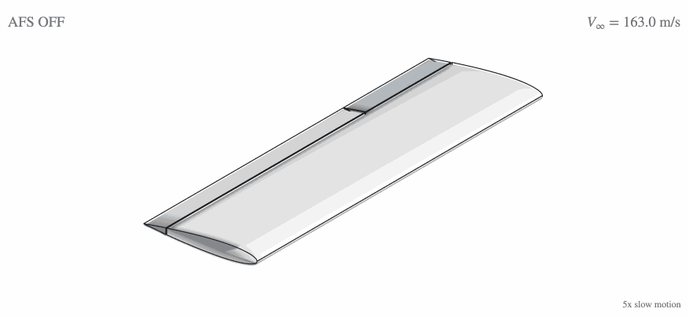</p>
<p align="center"><em>A short illustration of the Goland wing crossing its flutter boundary under a modal disturbance. The blue flap damps the motion after switch-on. Playback is slowed and the airfoil skin is a drawing aid.</em></p>

Finally let's run some time simulations and visualize the controller in action.

The code uses modal multisine disturbances to illustrate turbulence-like excitation; neither includes a physical gust model. The time simulation complements the fixed-velocity eigenvalue analysis. Velocity now varies with time, so the model is linear parameter-varying,

$$
\dot{\mathbf x} = \mathbf A\big(V_\infty(t)\big)\,\mathbf x + \mathbf B\big(V_\infty(t)\big)\,\mathbf u ,
$$

which the Control System Toolbox represents as an `lpvss` object: a data function that returns the state-space matrices at any value of the scheduling parameter. `build_LPV_P_Goland(100, 1, 1, 1:5)` returns the generalized plant of chapter 12 in that form. `lsim` integrates it along a velocity trajectory, and `lft(LPV_P, K)` closes the loop.

Our first virtual flight is 60 s. The velocity ramps steadily from 150 to 185 m/s while a continuous multisine disturbance, twelve sinusoids between 3 and 20 Hz on each of the first two modes, shakes the wing like light turbulence. Below the flutter boundary the wing moves at the centimeter level. Beyond it the flutter mode grows exponentially. Once the tip deflection exceeds 2.5 % of the semispan (15 cm), the controller of chapter 10 is switched on.

<p align="center">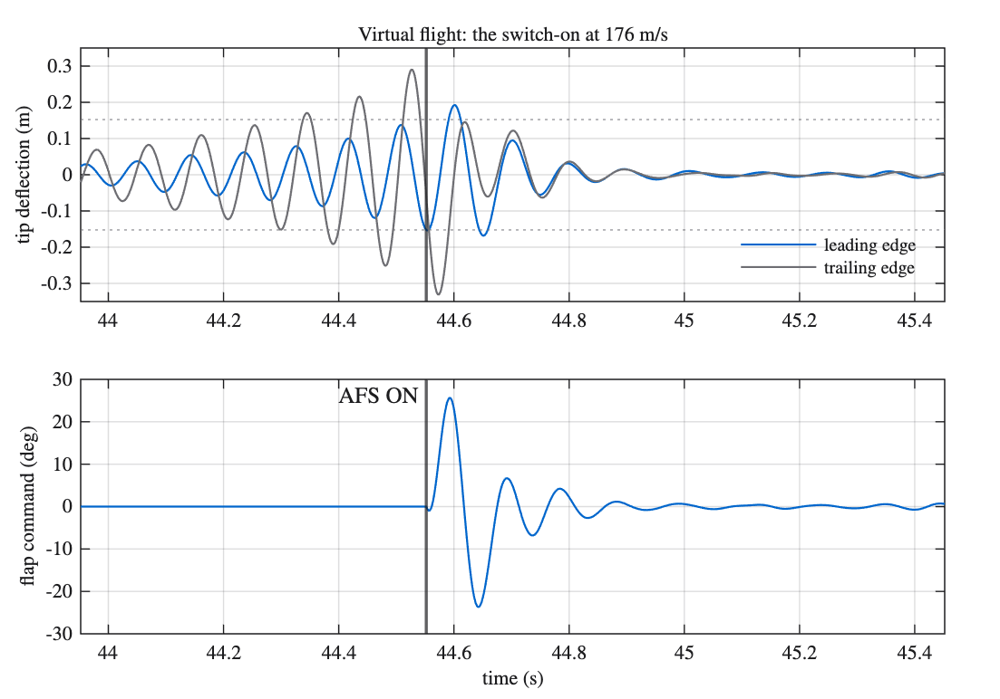</p>
<p align="center"><em>Top: leading edge (blue) and trailing edge (muted) tip deflections, with the switch-on threshold (dotted). Bottom: the flap command in the same window; the line marks the instant the controller switches on.</em></p>

Damping this oscillation after the tip reaches 15 cm requires a peak flap command of about 26 degrees. The simulation imposes no actuator deflection or rate limits, so it does not establish whether a particular servo could actually deliver that response.

The `ss` array supports analysis and synthesis at sampled velocities; the `lpvss` supports simulation along a trajectory. Both use `build_ABCD_P` with the same state ordering and scaling, so the supplied controller connects to either form.

<details>
<summary>Derivation</summary>

**The data function.** `build_LPV_P_Goland` builds the structure, the aerodynamics and the actuator once, then hands `lpvss` a function that, for a given $`V_\infty`$, calls `build_ABCD_P`, applies the scalings of chapters 9 and 12 and wires the actuator in with explicit block matrices,

$`\displaystyle \mathbf A = \left[\ \begin{matrix} \tilde{\mathbf A}_s \\ \mathbf 0 \end{matrix} \quad \begin{matrix} \tilde{\mathbf B}_{s,F}\,\mathbf C_a \\ \mathbf A_a \end{matrix}\ \right],`$

and correspondingly for $`\mathbf B`$, $`\mathbf C`$, $`\mathbf D`$ (with $`\mathbf A_a`$, $`\mathbf B_a`$, $`\mathbf C_a`$, $`\mathbf D_a`$ the actuator and $`\tilde{\mathbf B}_{s,F}`$ the three columns that take deflection, rate and acceleration). It does not call `connect`: `lsim` on an `lpvss` evaluates the data function about twice per time step (its TR-BDF2 integrator), tens of thousands of times per flight, and a `connect` per evaluation would take minutes. The state order is the same as in the `ss` array: plant first, actuator after, controller last once the loop is closed.

**The switch-on.** The open-loop flight is simulated first over the whole ramp with the modal outputs of the plant. The tip deflection follows from them through the same `build_IMU` map as the sensor, evaluated at the leading and trailing edge of the tip (the modal outputs of the generalized plant are scaled, chapter 12, so they are descaled first). The first sample above the threshold is the switch-on index. The closed loop starts from the plant state at that sample with the controller state at zero, and the two histories are stitched. The README animation does the same with the ramp compressed to 1.8 s and the threshold at 8 cm (`docs/figures/make_virtual_flight_gif.m`).

</details>

**Source:** `build/build_LPV_P_Goland.m`, `build/build_ABCD_P.m`; `docs/figures/make_virtual_flight_gif.m` for the animation. **Run it:** `TUTORIAL.m` section (11).

## 12. How the shipped controller was designed (optional)

<p align="center">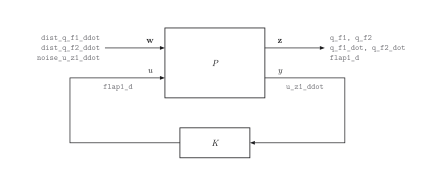</p>
<p align="center"><em>The generalized plant <i>P</i> of the Goland wing with the channel names of <code>build_P_Goland(V, 1, 1, [1 2])</code>. The exogenous inputs <i>w</i> (modal disturbances on modes 1 and 2, sensor noise) and the control input <i>u</i> (flap demand) enter; the performance outputs <i>z</i> (modal coordinates, modal rates, the demand itself) and the measurement <i>y</i> leave. The controller <i>K</i> closes the lower loop, <i>u</i> = <i>K y</i>.</em></p>

Controller synthesis in this repository is fixed-structure H-Infinity optimization using `systune`

**The channels.** `build_P_Goland` adds to $`G`$ a disturbance input on the acceleration of each selected mode, a noise input on the sensor, and as outputs the selected modal coordinates, their rates and the demand itself. For modes 1 and 2:

$$
\begin{bmatrix} \mathbf w \\ u \end{bmatrix} =
\begin{bmatrix} \texttt{dist\_q\_f1\_ddot} \\ \texttt{dist\_q\_f2\_ddot} \\ \texttt{noise\_u\_z1\_ddot} \\ \texttt{flap1\_d} \end{bmatrix}, \qquad
\begin{bmatrix} \mathbf z \\ y \end{bmatrix} =
\begin{bmatrix} \texttt{q\_f1} \\ \texttt{q\_f2} \\ \texttt{q\_f1\_dot} \\ \texttt{q\_f2\_dot} \\ \texttt{flap1\_d} \\ \texttt{u\_z1\_ddot} \end{bmatrix} .
$$

The partition is by size, the convention `lft(P, K)` expects: the last input is $`u`$, the last output is $`y`$, and everything before them is $`w`$ and $`z`$.

**The scaling.** The modal channels are scaled so that one unit of every structural channel carries the same energy. With $`K_{ff,11}`$ the modal stiffness of mode 1,

| Channel | Scaled as | One unit is |
|---|---|---|
| modal coordinate $`q_{f,i}`$ | $`\sqrt{K_{ff,ii}/K_{ff,11}}\;q_{f,i}`$ | the strain energy $`\tfrac12 K_{ff,11}`$ |
| modal rate $`\dot q_{f,i}`$ | $`\sqrt{M_{ff,ii}/K_{ff,11}}\;\dot q_{f,i}`$ | the kinetic energy $`\tfrac12 K_{ff,11}`$ |
| modal disturbance | $`\sqrt{M_{ff,ii}/K_{ff,11}}\;w_i`$ | the same power into every mode |
| measured acceleration, noise | physical value divided by $`\omega_1^2 = K_{ff,11}/M_{ff,11}`$ | mode 1's acceleration at unit amplitude |
| flap demand | unscaled | one radian |

Without it the modal stiffnesses, which span a factor 27 between mode 1 and mode 5, would make the optimiser weigh the modes by a numerical accident of the mode-shape normalisation. The chosen scaling norms ensure `systune` minimises physical energy.

**The design.** `R00_Synthesize_Goland_Controller.m` tunes a fourth-order state-space block with a fixed first-order low-pass, on $`P`$ at six velocities from 90 to 190 m/s. The low-pass reduces controller activity above the actuator bandwidth.

Three "soft goals" or objectives limit the modal response to disturbances and the flap demand caused by disturbances and sensor noise. The control-effort weight spans 20 to 150 rad/s, around the flutter frequency of 70 rad/s. A "hard goal" or constraint requests a disk margin of 6 dB and 45 degrees at the plant input. This is the chosen design target: the margin measures tolerance to simultaneous gain and phase variations (disk margin) before instability.

The script seeds the random number generator, runs three random starts, asserts stability on the 42-point grid and saves the result. The paper scripts apply related tuning workflows to the eight-surface wing with blending structures.

<details>
<summary>Derivation</summary>

**The energy argument.** The strain energy of mode $`i`$ at modal amplitude $`q_{f,i}`$ is $`\tfrac12 K_{ff,ii}\,q_{f,i}^2`$. Define the scaled coordinate $`\tilde q_i = \sqrt{K_{ff,ii}/K_{ff,11}}\;q_{f,i}`$; then $`\tfrac12 K_{ff,11}\,\tilde q_i^2 = \tfrac12 K_{ff,ii}\,q_{f,i}^2`$, so a unit of $`\tilde q_i`$ carries the strain energy $`\tfrac12 K_{ff,11}`$ whatever the mode. The same with $`M_{ff,ii}`$ for the kinetic energy of the rate. For the disturbance, a modal acceleration input $`w_i`$ is a modal force $`M_{ff,ii}\,w_i`$; its power is $`M_{ff,ii}\,w_i\,\dot q_{f,i}`$, which in scaled variables is $`K_{ff,11}\,\tilde w_i\,\tilde{\dot q}_i`$, mode-independent. In the code, `build_P_Goland` applies these as `OutScale` (`q_f_scale`, `q_f_dot_scale`, `u_z_ddot_scale`) and `InScale` (`dist_q_f_ddot_scale`, `noise_u_z_ddot_scale`, ones for the demand), on top of the state scaling of chapter 9. The mode-shape normalisation of chapter 2 (largest entry one) is what makes $`M_{ff}`$ and $`K_{ff}`$ carry the factors that need compensating.

**The Theis weight.** The two control-effort goals bound the gain by $`V_u/V_n`$ and $`V_u/V_d`$ times the inverse of a bandpass-like filter, $`\dfrac{(s + 0.01\,\omega_1)(0.01\,s + \omega_2)}{(s + \omega_1)(s + \omega_2)}`$ with $`\omega_1 = 20`$ and $`\omega_2 = 150`$ rad/s. Inside the band the bound is loose; outside it tightens by a factor of 100, so the controller may act at the flutter frequency and must stay quiet elsewhere.

</details>

**Source:** `build/build_P_Goland.m`, `build/build_ABCD_P.m`, `R00_Synthesize_Goland_Controller.m`. **Run it:** `TUTORIAL.m` section (12) prints the channels and the scaling table; the synthesis itself is `R00_Synthesize_Goland_Controller.m` (about 3 min) and overwrites the shipped `.mat`.

## Where to go next

### The papers

`research-paper-code/` holds one folder per paper, the shipped controllers and the runtimes. The `R*` scripts are the synthesis and sweep runs, the `fig*` scripts regenerate the figures from the shipped data.

- **Open-Source Benchmark Model for Active Flutter Suppression** (AIAA SciTech 2026): this model, its flutter mechanism, and a static gain from two accelerometers to flap 4 as the first controller.
- **Modal Blending for Active Flutter Suppression** (AIAA SciTech 2026): all eight accelerometers blended into a few signals that look like the modes, so that a low-order controller on flap 4 sees the flutter mode and little else.
- **Structural Blending for Active Flutter Suppression** (IFASD 2026): blending vectors taken from the structural mode shapes on both sides, eight accelerometers in and eight surfaces out, with a geometric mode-isolation study and a sensor-failure test.
- **Subspace Geometry and Performance Limits of Modal Blending for AFS** (Aerospace Systems, to be released): what blending can and cannot achieve, derived from the geometry of the modal subspaces.

### Adding a wing

Copy `define/define_Goland_Structure_Aero.m`, change the numbers of chapter 1, adjust the flap panels and the hinge points to your grid. Then copy `build_G_Goland.m` and `build_P_Goland.m` and replace the define call and the surface count. The new wing then has entry points with the same signatures, so `getEigenvalueModeshape`, `Vg_plot`, `simulate_afs_switch` and `animate_wing` work on it unchanged.

### Citing

If FlutterWing helps your research, cite the benchmark paper: J. Eichelsdörfer, *Open-Source Benchmark Model for Active Flutter Suppression*, AIAA SciTech Forum 2026, AIAA 2026-1555, [doi:10.2514/6.2026-1555](https://doi.org/10.2514/6.2026-1555); the README carries the BibTeX.

**Disclaimer:** I wrote this tutorial in its original form in german language. The tutorial was then translated to english and extended with the help of generative AI.